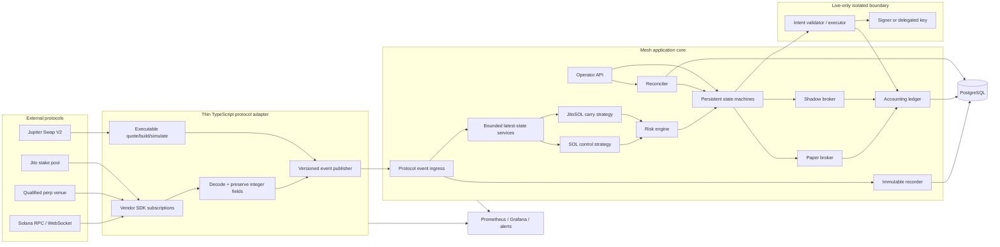
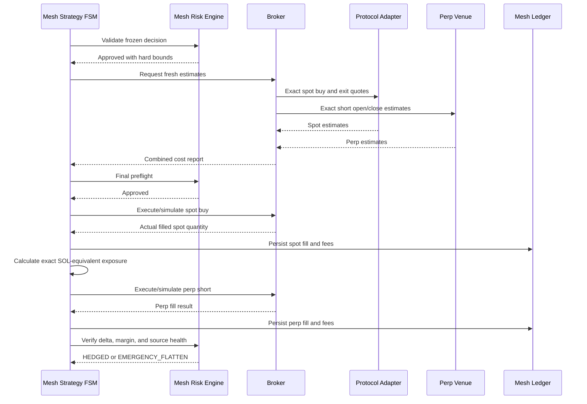
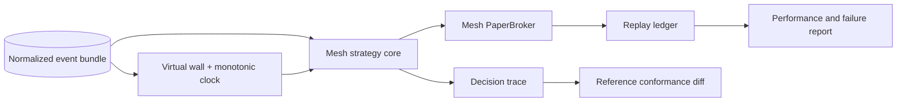
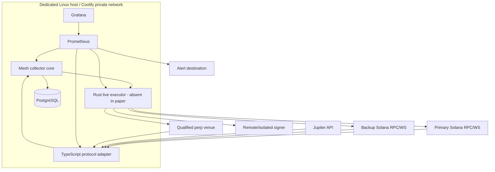

# Delta-Neutral Funding-Rate Collector

## Detailed Mesh-First Implementation Plan for Solana Spot + Perpetual Futures

**Document status:** Implementation-ready architecture, Mesh language workstream, and phased build plan  
**Primary application language:** Mesh  
**Protocol integration boundary:** Thin TypeScript adapter initially; reusable Rust-backed Mesh packages where native functionality is required  
**Default operating mode:** `paper`  
**Paper strategies:** `SOL_CONTROL` and `JITOSOL_CARRY`  
**Live candidate:** Whichever strategy passes its own paper, shadow, risk, and liquidity gates; JitoSOL is allowed to be the first live canary  
**Strategy direction:** Long SOL or JitoSOL + short SOL perpetual when shorts are expected to receive positive funding  
**Mesh capability audit baseline:** `hyperpush-org/mesh-lang` commit `a057ac2051b5398ecbc036a9e1c3631407983a90`; re-audit the current tree before implementation  
**Prepared:** July 25, 2026  
**Revision:** Mesh-first dogfooding architecture, JitoSOL dual-paper MVP, and complete Mesh language/runtime workstream

> **Risk notice:** This system can lose money despite being described as “delta-neutral.” Funding can reverse, the hedge can fail, JitoSOL can trade away from its protocol exchange rate, instant exit liquidity can disappear, a venue or smart contract can fail, an oracle can become invalid, and a short can be liquidated. Paper and shadow results are not guarantees of live performance. Venue eligibility and applicable laws must be checked before live trading; access restrictions must not be bypassed.

---

## Table of Contents

1. [Executive Summary](#1-executive-summary)
2. [Strategy Definition](#2-strategy-definition)
3. [MVP Scope and Deliberate Exclusions](#3-mvp-scope-and-deliberate-exclusions)
4. [Venue and Adapter Strategy](#4-venue-and-adapter-strategy)
5. [Recommended Mesh-First Technology Stack](#5-recommended-mesh-first-technology-stack)
6. [Mesh Language and Runtime Workstream](#6-mesh-language-and-runtime-workstream)
7. [System Architecture](#7-system-architecture)
8. [Paper, Shadow, and Live Execution Boundary](#8-paper-shadow-and-live-execution-boundary)
9. [Core Domain Model](#9-core-domain-model)
10. [Market Data and Normalization](#10-market-data-and-normalization)
11. [Opportunity and Carry Model](#11-opportunity-and-carry-model)
12. [Strategy State Machine](#12-strategy-state-machine)
13. [Entry, Hedge, Rebalance, and Exit Workflows](#13-entry-hedge-rebalance-and-exit-workflows)
14. [Paper Trading Engine](#14-paper-trading-engine)
15. [Shadow and Live Execution Engine](#15-shadow-and-live-execution-engine)
16. [Risk Engine and Kill Switches](#16-risk-engine-and-kill-switches)
17. [Accounting and P&L](#17-accounting-and-pl)
18. [Database Design](#18-database-design)
19. [Configuration](#19-configuration)
20. [Internal APIs and Operator Commands](#20-internal-apis-and-operator-commands)
21. [Observability and Alerts](#21-observability-and-alerts)
22. [Testing, Differential Validation, and Historical Replay](#22-testing-differential-validation-and-historical-replay)
23. [Security Model](#23-security-model)
24. [Deployment Architecture](#24-deployment-architecture)
25. [Failure Runbooks](#25-failure-runbooks)
26. [Phased Implementation Plan](#26-phased-implementation-plan)
27. [Go-Live Gates](#27-go-live-gates)
28. [Post-MVP Expansion](#28-post-mvp-expansion)
29. [Definition of Done](#29-definition-of-done)
30. [Reference Sources](#30-reference-sources)

---
# 1. Executive Summary

The system monitors executable prices, funding behavior, account health, and JitoSOL state for a SOL perpetual market. It runs two paper portfolios against the same live event stream:

```text
SOL_CONTROL
  Long N SOL
  Short N SOL-PERP

JITOSOL_CARRY
  Long Q JitoSOL
  Short Q × executable_SOL_per_JitoSOL SOL-PERP
```

`SOL_CONTROL` establishes the pure funding baseline. `JITOSOL_CARRY` tests the intended yield-enhanced strategy, in which expected revenue can come from both perpetual funding and JitoSOL exchange-rate appreciation. Running them together makes the incremental benefit and risk of JitoSOL measurable instead of assumed.

The application uses three execution modes behind one strategy interface:

- **Paper:** consumes live data and executable quotes, but writes only simulated orders, fills, funding payments, JitoSOL reward accrual, fees, and balances. It has no signer and cannot build or submit a live transaction.
- **Shadow:** uses the real transaction/order construction path and RPC simulation, but cannot sign or submit. It measures whether the proposed live path agrees with the paper model.
- **Live:** submits real spot and perpetual orders through a separately isolated execution/signing boundary after all startup and go-live gates pass.

The strategy core, paper engine, risk engine, accounting ledger, persistent state machine, replay system, storage layer, operator API, and orchestration should be written in **Mesh**. A deliberately narrow TypeScript protocol adapter initially handles vendor SDKs that would otherwise delay the project:

- Drift or the selected perpetual venue SDK.
- Solana account subscriptions and SDK-specific decoding.
- Jupiter Swap V2 quote/build calls.
- Jito stake-pool account decoding.
- Transaction building and simulation until the reusable Mesh Solana packages are ready.

The adapter is not allowed to decide whether to trade, size a strategy, calculate expected return, manage risk, or own accounting. It transports high-fidelity integer data into Mesh and executes high-level intents produced by Mesh.

The initial release remains narrow:

- Positive funding only: long spot, short SOL perpetual.
- One qualified perpetual venue.
- Jupiter as the initial spot route provider.
- SOL and JitoSOL only.
- One active position per strategy variant.
- No user deposits or third-party capital.
- No negative-funding reversal, flash loans, cross-venue perp arbitrage, or arbitrary-token support.
- Paper mode enabled by default.
- Shadow and live deployments are separate processes and identities, not runtime dashboard toggles.

The project is also a serious Mesh dogfooding exercise. Mesh should own every component it can safely and productively own, while native packages and sidecars remain explicit escape hatches. Language work is staged so the trading project never waits for an ambitious compiler feature that can be temporarily isolated behind a stable contract.

---
# 2. Strategy Definition

## 2.1 Strategy variants

### SOL control

```text
Spot leg:       +N SOL
Perpetual leg:  -N SOL
Target net:      0 SOL delta
```

This is the cleanest funding-rate experiment because both legs reference SOL directly. It provides a benchmark for funding revenue, execution costs, forecast error, and hedge quality.

### JitoSOL carry

```text
Spot leg:       +Q JitoSOL
Perpetual leg:  -(Q × current executable SOL/JitoSOL rate) SOL
Target net:      approximately 0 SOL delta
```

JitoSOL is reward-bearing rather than rebasing. Its token quantity remains stable while the protocol exchange rate appreciates as staking and MEV rewards accrue. The hedge therefore needs periodic adjustment as one JitoSOL represents more SOL over time.

## 2.2 Protocol NAV and executable market rates

Store three independent JitoSOL rates:

```text
protocol_nav_rate
  = total_pool_lamports / JitoSOL_token_supply

executable_buy_rate
  = SOL spent / JitoSOL received at target entry size

executable_sell_rate
  = SOL received / JitoSOL sold at target exit size
```

Do not hedge or value an emergency exit using only the protocol NAV. The position can be worth one amount under the stake-pool formula and a different immediately executable amount on DEX liquidity.

The default hedge uses a conservative executable rate:

```text
spot_equivalent_sol
  = jitosol_quantity × conservative_market_sol_per_jitosol

perp_target_sol
  = -spot_equivalent_sol
```

For normal monitoring, the conservative market rate may be a bounded blend of the executable sell quote and protocol NAV. For emergency risk, use the immediately executable sell rate at the position size.

## 2.3 Why the hedge is approximate

Even the SOL control is not perfectly neutral because:

- Spot and perp execution prices differ.
- The perp mark, index, oracle, and executable price differ.
- The two legs cannot always be opened or closed atomically.
- Orders can partially fill or have an unknown outcome.
- Funding and fees alter account balances.

JitoSOL adds:

- JitoSOL/SOL market basis.
- Protocol NAV versus market-price divergence.
- Reward-driven growth in SOL-equivalent exposure.
- Instant-exit depth and slippage risk.
- Direct-unstake delay and protocol risk.

## 2.4 MVP direction

Only enter when the short is expected to receive funding:

```text
Positive funding for shorts
  -> acquire SOL or JitoSOL
  -> short equivalent SOL perpetual exposure
```

Negative-funding capture is excluded because it generally requires borrowing and selling SOL spot while going long the perp, adding borrow availability, borrow rate, recall, and spot-short liquidation risks.

## 2.5 Capital layout

The strategy needs separate capital buckets:

1. **Spot capital:** stablecoin or SOL used to acquire the spot leg.
2. **Perp collateral:** stablecoin collateral for the SOL short.
3. **Fee reserve:** SOL for transactions and retries.
4. **Emergency reserve:** stablecoin held outside the active perp account.

The live system must not rely on maximum advertised leverage. The short should be intentionally overcollateralized, and the bot must prefer reducing exposure over repeatedly adding collateral.

## 2.6 Sources of expected return

### SOL control

```text
Net return
  = realized funding received
  - spot and perp entry/exit fees
  - spread and slippage
  - chain and execution fees
  - hedge-error and recovery losses
```

### JitoSOL carry

```text
Net return
  = realized funding received
  + observed JitoSOL reward accrual
  + or - JitoSOL market-basis P&L
  - spot and perp entry/exit fees
  - spread and slippage
  - rehedging costs
  - chain and execution fees
  - recovery losses
```

Do not estimate JitoSOL reward revenue from a marketing APY alone. The paper engine should derive accrual from observed changes in the on-chain exchange rate, with a conservative haircut for forecast decisions.

## 2.7 Controlled and independent comparisons

The paper system runs both of these analyses:

- **Controlled comparison:** SOL and JitoSOL portfolios enter and exit at the same times and equivalent SOL notionals. This isolates the incremental JitoSOL contribution.
- **Independent comparison:** each strategy uses its own cost-complete entry and exit gates. This shows which configuration would actually have traded.

Every report must distinguish the controlled result from the independently optimized result.

---
# 3. MVP Scope and Deliberate Exclusions

## 3.1 Included in the paper MVP

- `SOL_CONTROL` and `JITOSOL_CARRY` portfolios running concurrently.
- One SOL perpetual venue selected through formal qualification.
- Jupiter Swap V2 executable quotes for SOL and JitoSOL entry/exit.
- JitoSOL protocol exchange-rate observations.
- JitoSOL executable buy and sell depth at the configured size.
- Immediate DEX exit simulation.
- Delayed direct-unstake simulation with its fee and epoch delay.
- Positive-funding strategy only.
- Live market-data recording and deterministic historical replay.
- Cost-complete opportunity scoring.
- Event-driven persistent strategy state machine.
- Realistic paper fills, partial fills, latency, fees, failures, and actual funding settlement.
- Separate staking-reward, market-basis, residual-delta, and funding P&L attribution.
- Risk limits, reconciliation, kill switches, operator API, metrics, and audit logs.
- Mesh-first strategy core and storage layer.
- Thin read-only TypeScript protocol adapter.

## 3.2 Included before a live canary

- Shadow execution using real transaction/order construction and RPC simulation.
- Isolated signer/executor service with strict intent validation.
- Program, mint, market, destination, and notional allowlists.
- Dedicated wallet and perp subaccount or delegated trading authority where supported.
- One explicitly selected live strategy variant.
- Separate paper control continuing beside live execution.

## 3.3 Excluded from the MVP

- mSOL or additional LSTs.
- Negative-funding capture.
- Multiple simultaneous markets or assets.
- Cross-venue perp-to-perp funding arbitrage.
- General smart-order routing across many perp venues.
- Flash loans.
- Automated withdrawals to arbitrary addresses.
- User deposits or management of third-party capital.
- Mobile trading controls.
- An LLM deciding whether to trade.
- A strategy that assumes advertised annualized funding or staking yield remains constant.
- Runtime switching between paper, shadow, and live through a dashboard.
- Making native Mesh signing a prerequisite for the first live canary.

## 3.4 Why JitoSOL belongs in paper MVP

Excluding JitoSOL would make the paper system validate a different strategy than the one likely to be deployed. Paper mode is the safest place to model its additional basis, liquidity, epoch, reward, and redemption behavior. Regular SOL remains the control rather than a mandatory live predecessor.

## 3.5 Live strategy selection

At the end of the paper and shadow soak, compare:

- Net return after all modeled and realized costs.
- Maximum drawdown.
- Maximum and time-weighted delta error.
- Exit depth and stressed liquidation cost.
- Funding forecast error.
- Reward accrual versus basis loss.
- Number and cost of rehedges.
- Operational complexity and failure rate.

The live candidate can be JitoSOL if it passes its additional gates. If it does not, the SOL control can become the canary or the project can remain paper-only.

---
# 4. Venue and Adapter Strategy

## 4.1 Keep protocol SDKs outside the strategy core

The Mesh core depends on versioned normalized contracts, not a concrete Solana or perpetual SDK. Protocol APIs, funding semantics, program IDs, account layouts, and SDK packages can change independently of the strategy.

The initial TypeScript adapter exposes read-only and shadow capabilities:

```text
ProtocolAdapter
  get_market_snapshot
  get_funding_snapshot
  get_margin_snapshot
  get_jitosol_snapshot
  get_spot_quote
  estimate_perp_open
  estimate_perp_close
  build_spot_transaction        # shadow/live only
  build_perp_order              # shadow/live only
  simulate_execution            # shadow/live only
  reconcile_external_state
```

The isolated live executor exposes only policy-constrained commands:

```text
ExecutionService
  execute_open_hedge(intent)
  execute_rebalance(intent)
  execute_close_hedge(intent)
  emergency_flatten(intent)
  get_execution_status(command_id)
```

The executor does not accept arbitrary transactions, instructions, destinations, mints, quantities, or message-signing requests.

## 4.2 Versioned bridge contract

Every adapter message includes:

```text
schema_version
adapter_name
adapter_build_commit
sdk_versions
venue
source_sequence_or_slot
source_timestamp_ms
adapter_received_at_ms
adapter_emitted_at_ms
payload_hash
payload
```

Rules:

- Monetary and quantity fields cross the boundary as integer atoms plus scale, or as validated decimal strings. Never use JSON floating-point numbers for balances or rates.
- Mesh rejects unknown required schema versions.
- The adapter and Mesh core exchange a startup capability manifest.
- The recorder persists the normalized message and raw-response hash.
- Replays consume recorded normalized messages, not current SDK output.
- Adapter-calculated economic values are reference values only; Mesh remains authoritative.

## 4.3 Perpetual venue qualification checklist

A venue is not approved merely because an SDK exists. Re-qualify the current venue immediately before shadow and live milestones.

### Funding mechanics

- Does positive funding definitively pay shorts?
- Is funding bilateral, pool-paid, socialized, or implemented as another position/borrow charge?
- What is the settlement interval and exact precision?
- Is settlement scheduled, lazy, capped, deferred, or dependent on account interaction?
- Which mark, index, oracle, or TWAP inputs determine funding?
- Are predicted and realized rates both available?
- Can funding receipts be delayed or unpaid?
- How are signs represented in SDK, events, and account balances?

### Execution

- Market, limit, IOC, post-only, and reduce-only behavior.
- Partial-fill, auction, and remainder behavior.
- Order expiry and cancellation semantics.
- Maximum slippage and price-band controls.
- Confirmation/finality model.
- Idempotent client-order identifiers.
- Devnet or safe test environment.
- Official TypeScript/Rust SDK maturity and release cadence.

### Risk

- Initial and maintenance margin formulas.
- Liquidation penalties and keeper behavior.
- Oracle-invalid or stale-oracle behavior.
- Insurance/backstop and social-loss mechanics.
- Maximum positions and open-interest limits.
- Collateral assets and stablecoin dependencies.
- Upgrade authority, pause controls, audits, and incident history.

### Operations and eligibility

- Historical funding endpoint/indexer.
- Real-time account and market subscriptions.
- Rate limits and status channel.
- Current program IDs, IDLs, mints, and official repositories.
- Operator eligibility under venue terms and applicable law.
- No bypass of geographic or account restrictions.

## 4.4 JitoSOL qualification

Before the JitoSOL portfolio is considered valid, verify:

- Stake-pool program and pool addresses from official sources.
- Formula and precision for total pool lamports and pool token supply.
- Current epoch and reward-update behavior.
- Current direct-unstake fee and cooldown semantics.
- Jupiter route depth at 1×, 2×, and stress-size target notional.
- Executable buy/sell spread and protocol-NAV deviation.
- Official mint, token program, and any token extension behavior.
- Fallback read source for pool state.
- Mesh-native and adapter calculations agree when both are available.

Fees, addresses, and waiting periods are reviewed configuration values, not constants embedded in strategy code.

## 4.5 Candidate policy

Maintain a research shortlist rather than a hard-coded endorsement:

- One currently operational Solana perp venue with explicit funding payments and an official SDK.
- A legally accessible centralized derivatives venue only if its custody, transfer, API, and counterparty risks are accepted.
- A pool-backed Solana perp product only when its economics genuinely produce collectible carry after every position and borrow fee.

The first implementation may use any currently operational qualified venue, but the core remains venue-neutral and the venue must pass the current checklist at implementation time.

---
# 5. Recommended Mesh-First Technology Stack

## 5.1 Primary-language decision

Use **Mesh for the application core**.

Mesh owns:

- Domain types and fixed-point calculations.
- Strategy state machines.
- Opportunity and carry calculations.
- SOL/JitoSOL comparative portfolios.
- Paper broker and deterministic fill model.
- Risk engine and kill switches.
- Accounting and P&L attribution.
- PostgreSQL persistence and leader lease.
- Reconciliation.
- Historical replay.
- Operator HTTP API and CLI orchestration.
- Structured events, metrics production, and health checks.

A small TypeScript service initially owns vendor-specific integration:

- Selected perp SDK subscriptions and transaction builders.
- Jupiter Swap V2 requests.
- Solana RPC/WebSocket SDK glue.
- Jito stake-pool decoding.
- Transaction simulation.

A separately isolated signer/executor owns live signing. It may initially be TypeScript or Rust. Moving it into Mesh is optional until the required binary and secret-memory primitives have been proven.

## 5.2 Why this split is appropriate

The strategy is not a millisecond-arbitrage race, so Mesh does not need to match a specialized HFT stack. The main integration risk is ecosystem SDK churn, not raw compute speed. Keeping SDK glue outside the core allows the project to dogfood Mesh extensively without reimplementing an entire Solana SDK before paper trading begins.

The sidecar boundary is intentionally narrow. A vendor adapter may:

- Decode vendor data.
- Preserve raw integer precision.
- Return executable estimates.
- Build or simulate a requested transaction.
- Execute an already approved high-level intent in live mode.

It may not:

- Decide whether an opportunity is profitable.
- Set target notional.
- Select risk thresholds.
- Change state-machine transitions.
- Maintain the authoritative ledger.
- Hide a partial fill or unknown outcome.

## 5.3 Core stack

| Layer | Recommendation |
|---|---|
| Strategy/runtime | Pinned Mesh compiler and runtime build |
| Concurrency | Mesh actors, services, supervisors, and typed messages |
| Application HTTP | Mesh `HTTP` server |
| Outbound HTTP | Mesh `Http` client for ordinary control traffic; protocol sidecar for SDK-heavy paths until the scheduler-aware client work is complete |
| Persistence | PostgreSQL through Mesh pool/query/repository APIs and raw SQL escape hatches where needed |
| Migrations | Mesh migration tooling or reviewed SQL migrations run by the deployment pipeline |
| Protocol adapter | Node.js LTS + strict TypeScript + official venue/Jupiter/Solana SDKs |
| Adapter validation | Runtime schemas; all large integers transported as decimal strings |
| Signer/executor | Isolated Rust or TypeScript process initially; no access from paper deployment |
| Internal transport | Versioned authenticated JSON over private HTTP; optional adapter-to-Mesh WebSocket push after soak |
| Metrics | Mesh metrics package exposing Prometheus text format |
| Dashboard | Grafana; no trading decisions in the dashboard |
| Logs | Structured JSON emitted by Mesh and sidecars with shared correlation IDs |
| Testing | `meshc test`, Rust runtime tests, adapter tests, PostgreSQL containers, recorded fixtures, and differential replay |
| Deployment | Docker Compose/Coolify on a dedicated Linux host |
| Secrets | External secrets manager references; isolated hot/delegate key |

## 5.4 No Redis initially

PostgreSQL is sufficient for:

- Durable events and ledgers.
- Leader/advisory locking.
- Idempotency and execution commands.
- Reconciliation records.
- Configuration versions.
- Low-frequency jobs and leases.

Keep latest market state in Mesh process memory. Add Redis only when many users, strategies, or independent workers create a demonstrated need.

## 5.5 Repository structure

```text
funding-collector/
├── mesh/
│   ├── apps/
│   │   ├── collector/main.mpl
│   │   ├── operator_api/main.mpl
│   │   └── replay_cli/main.mpl
│   ├── packages/
│   │   ├── domain/
│   │   ├── finance/
│   │   ├── protocol_contracts/
│   │   ├── market_data/
│   │   ├── strategy_core/
│   │   ├── risk_engine/
│   │   ├── accounting/
│   │   ├── broker_paper/
│   │   ├── broker_shadow/
│   │   ├── storage/
│   │   ├── replay/
│   │   ├── observability/
│   │   └── test_fixtures/
│   └── mesh.toml
├── adapters/
│   └── protocol-ts/
│       ├── src/perp/
│       ├── src/jupiter/
│       ├── src/jitosol/
│       ├── src/solana/
│       └── src/contracts/
├── executor/
│   └── signer-service/             # Absent from paper deployment
├── native/
│   ├── mesh-finance-native/        # Checked wide intermediates
│   ├── mesh-bytes-native/
│   ├── mesh-borsh-native/
│   └── mesh-solana-native/         # Added incrementally
├── infra/
│   ├── docker/
│   ├── grafana/
│   └── prometheus/
├── schemas/
│   ├── protocol-events-v1.json
│   ├── execution-intents-v1.json
│   └── execution-reports-v1.json
└── docs/
    ├── mesh-capability-audit.md
    ├── venue-qualification.md
    ├── go-live-checklist.md
    └── runbooks/
```

Language/runtime additions belong in the `mesh-lang` repository, not as unreviewed patches copied into this application. The trading project pins a known Mesh build and upgrades only through replay and soak gates.

---
# 6. Mesh Language and Runtime Workstream

## 6.1 Objective

Use the funding collector as a production-grade Mesh dogfood project while avoiding a situation in which compiler work blocks strategy validation. The rule is:

> Business logic defaults to Mesh. Unsafe, binary, cryptographic, or vendor-SDK work may temporarily cross a narrow boundary. Every boundary must be versioned, testable, and removable.

## 6.2 Capability audit policy

Do not treat the README as the source of truth. Before each implementation milestone:

1. Pin the exact Mesh commit or release.
2. Inspect compiler, runtime, examples, tests, and generated artifacts for the required capability.
3. Record the evidence in `docs/mesh-capability-audit.md`.
4. Classify each need as:
   - already supported;
   - pure Mesh package work;
   - reusable native package work;
   - compiler/runtime work;
   - temporarily delegated to a sidecar.
5. Re-run the relevant Mesh release proof and this project’s replay suite before upgrading.

At the audit baseline, the repository already demonstrates native LLVM compilation, actors, services, supervisors, timers, HTTP server/client primitives, a WebSocket server, PostgreSQL/SQLite access, JSON support, cryptographic hashes/HMAC, date-time functions, and a test runner. The important project-specific gaps are safe fixed-point arithmetic, binary-safe values, a first-party WebSocket client, bounded market-data delivery, reusable Solana codecs/primitives, and secure signing memory.

## 6.3 Development principles

- Prefer a **Mesh package** over a compiler change.
- Treat new syntax as a last resort; a reusable runtime intrinsic or native package is usually easier to stabilize, test, and remove.
- Prefer a **reusable native package** over adding ecosystem-specific dependencies to the core runtime.
- Add compiler syntax only when a library cannot express the capability safely.
- Never duplicate strategy or risk logic in TypeScript.
- Timebox nonessential language work; use the sidecar contract when a feature misses its target milestone.
- Every runtime addition requires unit, concurrency, failure, and memory-safety tests.
- Every finance primitive requires differential tests against a trusted Rust reference.
- Every network primitive requires bounded buffers, cancellation, and deterministic failure behavior.
- Every secret primitive must redact by default and make accidental serialization impossible.

## 6.4 Capability-to-gate matrix

| ID | Addition | Implementation form | Required by | Blocks paper MVP? | Temporary fallback |
|---|---|---|---|---:|---|
| `MESH-FIN-001` | Checked integer arithmetic with wide intermediates | Runtime intrinsics + stdlib API | Paper accounting | **Yes** | Small Rust native package called from Mesh |
| `MESH-FIN-002` | Fixed-point finance package and rounding policy | Pure Mesh package over `MESH-FIN-001` | Paper accounting | **Yes** | None; strategy math must stay in Mesh |
| `MESH-TIME-001` | Public monotonic clock and `Duration` helpers | Runtime + stdlib | Freshness, latency, soak | **Yes** | Adapter timestamps plus conservative wall-clock checks for initial recorder only |
| `MESH-TEST-001` | Injectable production/replay/test clock | Pure Mesh trait/package | Deterministic replay | **Yes** | None |
| `MESH-TEST-002` | Deterministic seeded PRNG | Pure Mesh or small native package | Reproducible failure simulation | **Yes** | Fixed scripted failures |
| `MESH-ACTOR-001` | Bounded/coalescing event delivery | Runtime channel or actor send API | Continuous market stream | **Yes before soak** | Adapter-side batching plus one latest-snapshot message per source |
| `MESH-PROC-001` | OS signal hooks and graceful supervised shutdown | Runtime/stdlib | Deployment | **Yes before soak** | Container stop grace period plus control endpoint |
| `MESH-OBS-001` | Structured JSON logging, correlation context, and redaction | Pure Mesh package + small runtime hooks | Paper soak | **Yes before soak** | Minimal JSON-lines logger |
| `MESH-METRICS-001` | Bounded-cardinality counters, gauges, histograms, and Prometheus rendering | Pure Mesh package | Paper soak | **Yes before soak** | Database-derived metrics and health endpoints |
| `MESH-PROTO-001` | Canonical versioned JSON contracts | Pure Mesh + schema files | Adapter boundary | **Yes** | None |
| `MESH-BYTES-001` | Binary-safe `Bytes` type | Compiler/runtime type | Native Solana read path | No | Base64/hex strings from adapter |
| `MESH-CODEC-001` | Binary Base64/Hex and Base58 over `Bytes` | Native/reusable packages | Solana primitives | No | Adapter conversion |
| `MESH-NUM-001` | Checked unsigned/wide-value support | Native opaque `U64`/`I128` package or later primitives | Generic Solana codecs | No | Decimal strings bounded into signed `Int` where safe |
| `MESH-NATIVE-001` | First-class native package/link boundary | Compiler/package manager/linker | Reusable ecosystem packages | No for paper; highly desirable before Solana port | Keep small intrinsics in runtime temporarily |
| `MESH-WS-001` | TLS WebSocket client with reconnect/backpressure | Runtime + stdlib | Mesh-native market subscriptions | No | TypeScript adapter owns WebSocket subscriptions |
| `MESH-HTTP-001` | Scheduler-aware nonblocking HTTP requests | Runtime refinement | Removing adapter HTTP paths | No | Adapter or dedicated Mesh job actor |
| `MESH-BORSH-001` | Borsh reader/writer | Native package with Mesh bindings | Jito/Solana account decoding | No | Adapter decoding |
| `MESH-ANCHOR-001` | Anchor discriminator/account decoder | Mesh/native package | Perp account decoding | No | Official SDK adapter |
| `MESH-SOL-READ-001` | Pubkey, RPC, account subscription, SPL token/stake-pool types | Mesh package over bytes/codecs | Mesh-native read path | No | Adapter |
| `MESH-SOL-TX-001` | Instruction, message-v0, ALT, transaction simulation/building | Mesh/native package | Shadow execution migration | No | Adapter builds and simulates |
| `MESH-SECRET-001` | `SecretString`/`SecretBytes`, redaction, zeroization | Runtime/native package | Mesh-native signer | No | Isolated signer sidecar |
| `MESH-CRYPTO-001` | Ed25519 key parsing/signing and secure randomness | Native package | Mesh-native signer | No | Isolated signer sidecar |
| `MESH-SIGNER-001` | Policy-constrained signer service in Mesh | Mesh app over secret/crypto/Solana packages | Optional post-canary migration | No | Rust/TypeScript signer service |

## 6.5 Required before the paper MVP

### 6.5.1 `MESH-FIN-001`: checked arithmetic

Mesh `Int` is suitable for stored atomic values only when all operations are checked. Add:

```mesh
Checked.add(a :: Int, b :: Int) -> Int!ArithmeticError
Checked.sub(a :: Int, b :: Int) -> Int!ArithmeticError
Checked.mul(a :: Int, b :: Int) -> Int!ArithmeticError
Checked.div(a :: Int, b :: Int) -> Int!ArithmeticError
Checked.abs(a :: Int) -> Int!ArithmeticError
Checked.mul_div(a :: Int, b :: Int, denominator :: Int, rounding :: Rounding) -> Int!ArithmeticError
Checked.rescale(raw :: Int, from_scale :: Int, to_scale :: Int, rounding :: Rounding) -> Int!ArithmeticError
```

`mul_div` must use at least a signed 128-bit intermediate in Rust and reject overflow, divide-by-zero, and an out-of-range final result. Required rounding modes:

```text
TowardZero
Floor
Ceil
HalfAwayFromZero
HalfEven
```

Acceptance criteria:

- No silent wraparound in debug or release builds.
- Results match a Rust reference across boundary-value and randomized fixtures.
- Division and rescaling have explicit rounding.
- Ledger, balances, rates, and P&L never use `Float`.
- Compiler optimization cannot remove overflow checks.

### 6.5.2 `MESH-FIN-002`: `mesh-finance`

Implement nominal application types in pure Mesh:

```text
Lamports
TokenAtoms
UsdMicros
PriceMicros
RatePpm
BasisPoints
QuantityAtoms
Slot
UnixMillis
MonotonicNanos
```

Each type wraps an `Int` and exposes only valid operations. Avoid passing bare integers across strategy functions.

Required helpers:

- Decimal-string parsing with scale and overflow checks.
- Fixed-scale formatting without scientific notation.
- Basis-point and parts-per-million conversions.
- Quantity × price with explicit output scale.
- Percentage/rate application with explicit rounding.
- Min/max/clamp.
- Sign and zero checks.
- Serialization as decimal strings, never JSON floating-point numbers.

### 6.5.3 `MESH-TIME-001` and `MESH-TEST-001`: monotonic and injectable time

Wall-clock time is required for persisted events; monotonic time is required for latency and staleness. Add a public monotonic API:

```mesh
Monotonic.now_nanos() -> Int
Duration.millis(n :: Int) -> Duration
Duration.seconds(n :: Int) -> Duration
Monotonic.elapsed(start :: Int, finish :: Int) -> Duration
```

Define an application `Clock` trait with:

```text
now_utc_ms
now_monotonic_ns
sleep_until
```

Implement:

- `SystemClock` for production.
- `ReplayClock` advanced only by recorded events.
- `TestClock` controlled by tests.

Persist wall-clock timestamps and source slots; never persist a monotonic value across process restarts.

### 6.5.4 `MESH-TEST-002`: deterministic PRNG

Paper fills and failure injection require reproducibility. Add a seeded generator with a stable algorithm and version:

```mesh
Random.seed(seed :: Int) -> RandomState
Random.next_int(state, min, max) -> (RandomState, Int)
Random.next_unit_ppm(state) -> (RandomState, Int)
```

Store the seed and algorithm version on every paper run. Primary reports should use deterministic replayed market conditions; randomized Monte Carlo is supplemental.

### 6.5.5 `MESH-ACTOR-001`: bounded/coalescing market-data delivery

The current strategy must not depend on an unbounded mailbox during a burst. Add a reusable bounded delivery primitive without requiring new syntax:

```mesh
Channel.bounded<T>(capacity :: Int, overflow :: OverflowPolicy)
Channel.try_send(channel, value) -> Unit!ChannelError
Channel.recv(channel, timeout :: Duration) -> T!ChannelError
Channel.depth(channel) -> Int
```

Policies:

```text
RejectNewest
DropOldest
LatestOnly
```

Market snapshots generally use `LatestOnly` per source/market key; funding settlements, orders, fills, and risk events use lossless bounded queues and halt the producer when capacity is exhausted.

Acceptance criteria:

- Capacity is enforced by item count and, where possible, byte count.
- Queue saturation is observable.
- Critical events are never silently dropped.
- Latest-only delivery records how many intermediate updates were coalesced.
- Producers cannot block a scheduler worker indefinitely.

### 6.5.6 `MESH-PROC-001`: graceful shutdown

Expose OS signal handling or a runtime shutdown hook:

```mesh
Process.on_signal(:sigterm, handler)
Process.on_signal(:sigint, handler)
Process.shutdown_deadline() -> Option<Duration>
```

Shutdown order:

1. Stop accepting new entry decisions.
2. Persist shutdown intent.
3. Drain noncritical market messages.
4. Finish or reconcile an in-flight command.
5. Flush ledger and logs.
6. Release leader lease.
7. Exit nonzero if state remains unsafe or unknown.

### 6.5.7 `MESH-OBS-001` and `MESH-METRICS-001`: application observability packages

Build these as pure Mesh packages unless profiling proves otherwise:

```text
Log.info(event, fields)
Log.warn(event, fields)
Log.error(event, fields)
Metrics.counter(name, labels)
Metrics.gauge(name, labels)
Metrics.histogram(name, buckets, labels)
Metrics.render_prometheus()
```

Requirements:

- Structured JSON only in production.
- Automatic timestamp, process ID, actor/service identity, run ID, and config hash.
- Redaction hooks for secret-bearing types.
- Bounded cardinality.
- Histogram support for adapter lag, decision time, order time, and unhedged duration.

### 6.5.8 `MESH-PROTO-001`: canonical protocol contracts

Define versioned data-transfer structures in Mesh and matching TypeScript schemas. All financial integers travel as base-10 strings.

Envelope:

```json
{
  "schemaVersion": 1,
  "eventId": "uuid",
  "eventType": "PerpMarketSnapshot",
  "source": "drift-mainnet",
  "observedAtMs": "1785024000000",
  "sourceSequence": "slot-or-sequence",
  "payload": {}
}
```

Requirements:

- Unknown major versions are rejected.
- Unknown optional fields are retained or safely ignored according to the schema.
- Every event has an idempotency key and raw-payload hash.
- Canonical serialization is available for hashing and signatures.
- Sidecar and Mesh contract fixtures run in both test suites.

## 6.6 Additions that move the read path into Mesh

### 6.6.1 `MESH-BYTES-001`: binary-safe `Bytes`

Mesh strings are UTF-8 values and should not represent arbitrary account data. Add a distinct `Bytes` type with:

```text
length
get(index)
slice(start, length)
concat
constant-time equality where requested
copy_to/from native memory
to/from Base64, Hex, Base58
read/write unsigned little-endian integers
```

`Bytes` must not implicitly convert to `String`. UTF-8 conversion returns `Result`.

### 6.6.2 `MESH-NUM-001`: unsigned and wide values

Do not add broad new numeric syntax solely for this project. Start with reusable native opaque types if needed:

```text
U64
I128
U128
```

Expose checked parse, compare, add/subtract, and conversion to bounded `Int`. Strategy-facing normalized values should remain scaled signed integers whenever they fit.

### 6.6.3 `MESH-NATIVE-001`: native package boundary

Avoid placing every ecosystem dependency in `mesh-rt`. Extend `meshpkg`, manifests, and the linker so a package can ship target-specific native libraries and generated bindings.

Conceptual manifest:

```toml
[dependencies]
finance = "hyperpush/mesh-finance@0.1"
solana = "hyperpush/mesh-solana@0.1"

[native]
libraries = ["mesh_finance_native", "mesh_solana_native"]
abi = 1
```

Required contract:

- Target-aware static library resolution.
- Stable ABI version check.
- Explicit ownership rules for pointers and handles.
- `Result` error translation.
- Build-script or generated binding support.
- Package checksum and lockfile pinning.
- No arbitrary linker flags from untrusted packages without an explicit trust policy.

This feature is the preferred path for Borsh, Ed25519, and Solana SDK wrappers.

### 6.6.4 `MESH-WS-001`: WebSocket client

Implement a client distinct from the existing server surface:

```mesh
WsClient.connect(url, options) -> Connection!WsError
WsClient.send_text(conn, body) -> Unit!WsError
WsClient.send_bytes(conn, body) -> Unit!WsError
WsClient.recv(conn, timeout) -> WsMessage!WsError
WsClient.close(conn, code, reason) -> Unit!WsError
```

Requirements:

- `wss://` with certificate validation.
- Ping/pong and heartbeat timeouts.
- Reconnect with bounded exponential backoff and jitter.
- Subscription restoration delegated to the caller.
- Maximum frame/message sizes.
- Bounded inbound queue and backpressure.
- Cancellation and graceful close.
- Text and binary frames.
- Source sequence regression detection at the application layer.

Reconnect policy should be a library helper, not hidden magic; the strategy must know when a stream was interrupted.

### 6.6.5 `MESH-HTTP-001`: scheduler-aware outbound HTTP

Audit whether every public `Http` path yields rather than blocking a scheduler worker. Add or verify:

- Connection pooling/keep-alive.
- Request cancellation.
- Per-stage timeouts.
- Bounded response bodies.
- Streaming with backpressure.
- Retry classification that never retries unsafe writes automatically.
- Metrics for DNS, connect, TLS, first byte, and total time.

The TypeScript adapter remains acceptable for SDK-heavy traffic until this passes soak tests.

### 6.6.6 `MESH-BORSH-001` and `MESH-ANCHOR-001`

Implement reusable codecs, preferably through native packages with Mesh wrappers.

Borsh reader requirements:

- Fixed-width signed and unsigned integers.
- Little-endian decoding.
- Booleans, fixed arrays, vectors, options, strings, and structs.
- Cursor bounds checks.
- Maximum collection sizes.
- No panics on malformed data.

Anchor requirements:

- Eight-byte discriminator calculation and validation.
- IDL-assisted field mapping where useful.
- Explicit program ID and account-owner validation.
- Versioned account layouts.

### 6.6.7 `MESH-SOL-READ-001`: `mesh-solana` read package

Initial read-only surface:

```text
Pubkey
Signature
Hash
RpcRequest/RpcResponse
AccountInfo
TokenAccount
Mint
Slot/BlockHeight
ProgramAccount filters
SPL stake-pool state needed for JitoSOL
WebSocket account and slot subscriptions
```

The first goal is to independently calculate JitoSOL protocol NAV and compare it against the TypeScript adapter. Do not replace the adapter until both outputs agree over an extended soak.

## 6.7 Additions for Mesh-native shadow/live execution

### 6.7.1 `MESH-SOL-TX-001`: transaction construction

Add incrementally:

- `AccountMeta`.
- `Instruction`.
- Legacy and versioned messages.
- Address lookup tables.
- Recent blockhash handling.
- Compute budget instructions.
- Transaction simulation.
- SPL token and associated-token instructions.
- Jupiter raw-instruction ingestion.

Every constructed transaction must be inspectable as a high-level allowlist report before signing.

### 6.7.2 `MESH-SECRET-001`: secure secret values

`SecretString` and `SecretBytes` must:

- Be nonserializable by default.
- Render as `[REDACTED]` through `Display`, logs, and errors.
- Use pinned/native memory when possible.
- Zeroize on explicit close/drop.
- Avoid accidental copies.
- Prohibit use as map keys or ordinary JSON fields.
- Expose narrowly scoped callback access rather than raw bytes where practical.

A GC-managed UTF-8 `String` is not an acceptable private-key container.

### 6.7.3 `MESH-CRYPTO-001`: Ed25519

Native package surface:

```text
Ed25519.public_key(secret)
Ed25519.sign(secret, message_bytes)
Ed25519.verify(public_key, message_bytes, signature)
Keypair.from_bytes(secret_bytes)
Keypair.from_solana_json(secret_bytes)
```

Requirements:

- Well-maintained audited Rust cryptography crates.
- No custom curve implementation.
- Known-answer tests.
- Zeroization.
- Secure random generation.
- Separate signing process remains recommended even after the language can sign.

### 6.7.4 `MESH-SIGNER-001`: policy-constrained Mesh signer

This is optional after the first live canary. The signer accepts only versioned `ExecutionIntent` messages and independently enforces:

- Expected strategy and deployment identity.
- Maximum notional and daily signed notional.
- Program/mint/market/destination allowlists.
- Maximum slippage and oracle deviation.
- Freshness and nonce/idempotency.
- No arbitrary message signing.
- No withdrawal instructions unless separately approved.

A native Mesh signer is considered ready only after a dedicated security review and a shadow period in which it produces byte-identical messages/signatures to the reference signer.

## 6.8 Project-local Mesh packages

These require no compiler changes and should be built immediately:

| Package | Responsibility |
|---|---|
| `domain` | Strategy variants, amounts, prices, orders, positions, events |
| `finance` | Fixed-point wrappers over checked arithmetic |
| `protocol_contracts` | Versioned adapter and executor messages |
| `market_data` | Source state, freshness, normalization, quality flags |
| `strategy_core` | Opportunity model and state machine |
| `broker_paper` | Fills, latency, failures, funding, JitoSOL accrual |
| `risk_engine` | Limits, breakers, health, emergency actions |
| `accounting` | Balanced ledger and P&L attribution |
| `storage` | PostgreSQL repositories and migrations |
| `replay` | Deterministic clock and event replay |
| `observability` | Logs, metrics, correlation, health |

## 6.9 Ownership matrix

| Component | Paper MVP owner | Eventual owner | Sidecar removal required for launch? |
|---|---|---|---:|
| Strategy decisions | Mesh | Mesh | Yes; never in sidecar |
| Risk limits | Mesh | Mesh | Yes |
| Paper fills | Mesh | Mesh | Yes |
| Funding and reward accounting | Mesh | Mesh | Yes |
| PostgreSQL ledger | Mesh | Mesh | Yes |
| Operator API | Mesh | Mesh | Yes |
| Replay | Mesh | Mesh | Yes |
| Perp SDK decode | TypeScript adapter | Mesh or adapter | No |
| Jupiter quote/build | TypeScript adapter | Mesh/native package or adapter | No |
| Jito account decode | TypeScript adapter + Mesh comparison | Mesh | No |
| Solana WebSocket client | TypeScript adapter | Mesh | No |
| Transaction build/simulation | Adapter | Mesh/native package | No |
| Signing | Isolated signer | Optional Mesh signer | No |
| Dashboard | Grafana/other | Unchanged | No |

## 6.10 No-hindrance escape-hatch policy

- A missing Mesh feature may delay only the component that directly requires it.
- Paper strategy logic cannot migrate into the adapter as a workaround.
- A sidecar must be stateless or reconstructible from Mesh/PostgreSQL state.
- Every sidecar action is represented by a versioned request and response persisted by Mesh.
- The sidecar cannot directly modify the authoritative strategy database.
- Language work is timeboxed by milestone. If it misses the gate, use the documented fallback and continue.
- Removing a sidecar requires a differential soak, not a rewrite flag flipped in production.

## 6.11 Language-work acceptance gate

A Mesh addition is usable by this project only when:

- Compiler/runtime tests pass in debug and release.
- The language’s retained release proof remains green.
- Sanitizer/Miri or equivalent native checks cover unsafe additions where practical.
- A standalone non-trading example demonstrates the feature.
- The funding collector’s unit, replay, and integration suites pass against it.
- Performance and memory behavior are measured under a recorded burst.
- Rollback to the previous pinned Mesh build is documented.
- Public ABI and serialized-contract compatibility are versioned when native packages or sidecars depend on them.
- A feature can be disabled or replaced by its documented bridge without changing strategy semantics.
- The feature has an owner, removal criterion, and explicit status in `docs/mesh-capability-audit.md`.

## 6.12 Language-work priority and adoption schedule

### P0 — required to trust paper results

- `MESH-FIN-001`
- `MESH-FIN-002`
- `MESH-TIME-001`
- `MESH-TEST-001`
- `MESH-TEST-002`
- `MESH-ACTOR-001` before continuous soak
- `MESH-PROC-001` before continuous soak
- `MESH-OBS-001` before continuous soak
- `MESH-METRICS-001` before continuous soak
- `MESH-PROTO-001`

These are the only language/runtime additions allowed to block the paper-soak milestone. Even here, the preferred order is pure Mesh package, narrow runtime intrinsic, then documented bridge.

### P1 — used to move read-only protocol work into Mesh

- `MESH-BYTES-001`
- `MESH-CODEC-001`
- `MESH-NUM-001`
- `MESH-NATIVE-001`
- `MESH-WS-001`
- `MESH-HTTP-001`
- `MESH-BORSH-001`
- `MESH-ANCHOR-001`
- `MESH-SOL-READ-001`

P1 work proceeds in parallel with paper trading. No P1 item may delay paper data collection; the TypeScript adapter remains the accepted bridge until a Mesh implementation passes differential soak.

### P2 — optional route toward Mesh-native execution

- `MESH-SOL-TX-001`
- `MESH-SECRET-001`
- `MESH-CRYPTO-001`
- `MESH-SIGNER-001`

P2 is not a first-live-canary requirement. The isolated executor/signer is the safer default and may remain permanent. Move these responsibilities into Mesh only when doing so reduces complexity without weakening isolation or security.

### Adoption rule

A new Mesh implementation replaces a bridge only after:

1. Fixture-level equality.
2. Recorded replay equality.
3. Live read-only or shadow differential equality.
4. A bounded soak period with no unresolved divergence.
5. A rollback rehearsal.

The project tracks two independent percentages:

```text
mesh_business_logic_ownership_percent
mesh_total_code_ownership_percent
```

The first should approach 100% early. The second is not a goal by itself; retaining a small, well-isolated vendor adapter is preferable to porting unstable SDK internals merely to increase a percentage.

---
# 7. System Architecture



## 7.1 Mesh supervisor tree

```text
RootSupervisor
├── ProtocolIngressSupervisor
│   ├── AdapterHealthService
│   ├── EventValidatorService
│   └── EventRecorderService
├── MarketStateSupervisor
│   ├── SpotStateService
│   ├── PerpStateService
│   ├── FundingStateService
│   └── JitoSolStateService
├── StrategySupervisor
│   ├── SolControlStrategyService
│   └── JitoSolCarryStrategyService
├── ExecutionSupervisor
│   ├── PaperBrokerService
│   ├── ShadowBrokerService        # Shadow deployment only
│   └── CommandReconcilerService
├── LedgerSupervisor
│   ├── LedgerWriterService
│   └── PnlProjectionService
├── RiskSupervisor
│   ├── RiskEngineService
│   └── BreakerService
└── OperationsSupervisor
    ├── LeaderLeaseService
    ├── OperatorApiService
    ├── MetricsService
    └── ShutdownCoordinator
```

Each service has one authoritative responsibility. Restart strategy must reflect dependencies: market-source failure should not erase ledger state, and an accounting failure should stop execution rather than silently restart into an unknown state.

## 7.2 Adapter responsibilities

The adapter:

- Maintains official SDK subscriptions.
- Emits raw integer fields as strings.
- Includes source timestamps, slots, sequences, and SDK version.
- Obtains executable estimates at an exact requested size.
- Builds/simulates requested shadow transactions.
- Returns execution reports in live mode.

It never evaluates expected carry or changes Mesh state.

## 7.3 Mesh ingress contract

Mesh validates:

- Schema major version.
- Source identity and authentication.
- Event ID uniqueness.
- Monotonic source sequence where applicable.
- Integer-string format and bounds.
- Timestamp and slot plausibility.
- Maximum payload size.
- Raw-payload hash.

Invalid events are quarantined and alert; they do not update latest state.

## 7.4 State and event ownership

- PostgreSQL is authoritative for commands, transitions, fills, funding, rewards, ledger entries, and configuration.
- In-memory Mesh services hold only reconstructible latest state and bounded work queues.
- Raw adapter payloads are stored redacted and hashed.
- The adapter has no direct write credentials to strategy tables.
- Only the elected Mesh leader may create execution intents.

## 7.5 Process separation by mode

```text
Paper deployment:
  Mesh core + read-only adapter + PostgreSQL
  No signer container, secret, route, or network policy

Shadow deployment:
  Mesh core + adapter build/simulate capability + PostgreSQL
  No signer secret and no submit permission

Live deployment:
  Mesh core + adapter/executor + isolated signer + PostgreSQL
  Separate wallet, account, config, and network identity
```

---
# 8. Paper, Shadow, and Live Execution Boundary

## 8.1 Non-negotiable design rule

Do not scatter `if paper` branches through strategy code. Select one broker implementation at process startup and keep the same strategy, risk, accounting, and state-machine paths.

Conceptual Mesh contract:

```mesh
type ExecutionMode do
  Paper
  Shadow
  Live
end

trait ExecutionBroker do
  fn mode(self) -> ExecutionMode
  fn balances(self) -> BrokerBalances!BrokerError
  fn estimate_spot(self, request :: SpotOrderRequest) -> ExecutionEstimate!BrokerError
  fn estimate_perp(self, request :: PerpOrderRequest) -> ExecutionEstimate!BrokerError
  fn execute_spot(self, request :: SpotOrderRequest) -> ExecutionResult!BrokerError
  fn execute_perp(self, request :: PerpOrderRequest) -> ExecutionResult!BrokerError
  fn open_orders(self) -> List<BrokerOrder>!BrokerError
  fn positions(self) -> BrokerPositions!BrokerError
  fn funding(self, until_ms :: Int) -> List<FundingSettlement>!BrokerError
  fn reconcile(self) -> BrokerReconciliation!BrokerError
end
```

Exact trait syntax may be adjusted to the current language surface, but the semantic boundary is mandatory.

## 8.2 Boot-time selection

```text
EXECUTION_MODE=paper
EXECUTION_MODE=shadow
EXECUTION_MODE=live
```

The mode is read once at boot. There is no API that upgrades a running process to a more dangerous mode.

## 8.3 Paper guarantees

- No private key, delegate key, or signer endpoint is configured.
- No transaction submission permission exists at the network layer.
- The adapter runs with read-only and quote permissions.
- Every order and ledger event is tagged `paper`.
- Paper balances use a separate account namespace.
- A paper order cannot contain a chain signature.
- A paper strategy run cannot reference a live wallet/account.
- Startup and health endpoints state `PAPER` prominently.

## 8.4 Shadow guarantees

Shadow mode:

- Uses live market data.
- Requests the same transaction/order construction intended for live mode.
- Simulates transactions or venue orders.
- Records expected account deltas, fees, compute, and errors.
- Cannot sign or submit.
- Produces an `ExecutionPlan` that can be diffed against the paper estimate.

Shadow mode is required before live mode because it validates the integration path without exposing capital.

## 8.5 Live startup gates

The live broker may initialize only when all are true:

```text
EXECUTION_MODE=live
LIVE_TRADING_ENABLED=true
LIVE_TRADING_ACK=<deployment-specific acknowledgement>
config schema and hash are approved
strategy variant is explicitly selected
signer identifies the expected public key
wallet, perp account, programs, mints, and destinations match allowlists
max notional is non-zero and below deployment ceiling
reconciliation finds no unknown orders or positions
primary and backup data sources are healthy
protocol schema versions match
pinned Mesh and adapter builds match approved hashes
operator pause flag is false
```

Fail closed on any mismatch.

## 8.6 Separate strategy variants

Paper mode normally starts both variants:

```text
PAPER_RUN_SOL_CONTROL=true
PAPER_RUN_JITOSOL_CARRY=true
```

Live mode starts one selected variant per deployment:

```text
LIVE_STRATEGY_VARIANT=sol_control
# or
LIVE_STRATEGY_VARIANT=jitosol_carry
```

Do not share one position state between the variants.

## 8.7 Continuous shadow comparison after launch

A live deployment should retain a separate shadow or paper mirror using the same event stream. Compare:

- Decision timing and reason codes.
- Planned versus actual transaction accounts/instructions.
- Simulated versus actual fill.
- Predicted versus actual slippage and fees.
- Predicted versus realized funding.
- JitoSOL predicted reward accrual versus observed NAV change.
- Paper/shadow/live net P&L.

Large deviations block scaling and may trigger an exit.

---
# 9. Core Domain Model

## 9.1 Numeric rules

- Store token quantities in atomic units.
- Store USD in micros or a documented fixed scale.
- Store rates in parts per million or another fixed integer scale.
- Store basis points as integers.
- Transport integers across process boundaries as decimal strings.
- Never use `Float` for balances, order quantities, prices, rates, fees, margin, or ledger entries.
- Every multiplication/division uses `Checked.mul_div` with an explicit rounding mode.

## 9.2 Important Mesh types

```mesh
type StrategyVariant do
  SolControl
  JitoSolCarry
end

type SpotAsset do
  Sol
  JitoSol
end

type ExecutionMode do
  Paper
  Shadow
  Live
end

struct AtomicAmount do
  asset :: String
  atoms :: Int
  decimals :: Int
end deriving(Json)

struct UsdMicros do
  value :: Int
end deriving(Json)

struct PriceMicros do
  quote_micros_per_base_unit :: Int
  base_asset :: String
  quote_asset :: String
end deriving(Json)

struct RatePpm do
  value :: Int
end deriving(Json)
```

Exact syntax can follow the current compiler, but these must remain nominal types rather than interchangeable bare integers.

## 9.3 Normalized market snapshot

Required fields:

```text
id
observed_at_ms
observed_monotonic_ns
source_timestamp_ms
source_sequence
solana_slot
schema_version

SOL executable buy/sell prices and depth
JitoSOL executable buy/sell prices and depth
JitoSOL protocol NAV rate
JitoSOL market/NAV deviation
current epoch and estimated epoch end

perp bid/ask
perp mark/index/oracle prices
oracle validity and confidence
predicted funding raw fields
last realized funding fields
perp depth and execution estimate
fees and position charges
quality flags
```

## 9.4 JitoSOL snapshot

```mesh
struct JitoSolSnapshot do
  observed_at_ms :: Int
  slot :: Int
  total_pool_lamports :: Int
  pool_token_supply_atoms :: Int
  protocol_nav_lamports_per_jitosol_atom :: Int
  executable_buy_lamports_per_jitosol_atom :: Int
  executable_sell_lamports_per_jitosol_atom :: Int
  buy_depth_usd_micros :: Int
  sell_depth_usd_micros :: Int
  market_nav_deviation_bps :: Int
  epoch :: Int
  epoch_progress_ppm :: Int
  quality_flags :: List<String>
end deriving(Json)
```

The scale for `*_per_jitosol_atom` must be documented and tested. Do not mix per-token and per-atom rates.

## 9.5 Hedge position

```mesh
struct HedgePosition do
  strategy_run_id :: String
  variant :: StrategyVariant
  spot_asset :: SpotAsset
  spot_quantity_atoms :: Int
  spot_equivalent_sol_lamports :: Int
  spot_cost_basis_usd_micros :: Int

  perp_market :: String
  perp_base_quantity_lamports :: Int  # negative for short
  perp_entry_price_usd_micros :: Int

  net_delta_lamports :: Int
  net_delta_bps :: Int
  gross_notional_usd_micros :: Int

  collateral_usd_micros :: Int
  maintenance_requirement_usd_micros :: Int
  margin_ratio_ppm :: Int
  liquidation_distance_bps :: Option<Int>
end deriving(Json)
```

## 9.6 Opportunity decision

An immutable decision records:

- Strategy variant.
- All source snapshot IDs and raw hashes.
- Config, cost-model, adapter, Mesh runtime, and code versions.
- Target spot and perp quantities.
- Expected funding.
- Expected JitoSOL reward accrual.
- Expected JitoSOL basis change/haircut.
- Entry, exit, rehedge, and chain costs.
- Risk checks and reason codes.
- Break-even holding time.
- Whether it is controlled-comparison-only or independently eligible.

## 9.7 Execution intent

Mesh emits a high-level intent, not arbitrary transaction bytes:

```text
intent_id
strategy_run_id
state_version
variant
operation: OPEN | REBALANCE | CLOSE | EMERGENCY_FLATTEN
leg: SPOT | PERP
asset/market
side
exact maximum quantity
minimum output or maximum price
maximum slippage
reduce_only
expires_at
approved programs/mints/accounts profile
market snapshot IDs
config hash
```

The executor independently rejects any intent outside its deployment policy.

---
# 10. Market Data and Normalization

## 10.1 Data inputs

### SOL and JitoSOL spot

- Jupiter executable buy quote at the intended size.
- Jupiter executable sell quote at the intended exit size.
- Raw input/output atom amounts.
- Route plan, venue composition, fees, and price impact.
- Quote request ID and expiration.
- Estimated transaction and priority fees where available.

### JitoSOL protocol state

- Stake-pool total lamports.
- Pool-token supply.
- On-chain exchange rate.
- Current epoch and progress.
- Account owner/program validation.
- Adapter-derived and, later, Mesh-native decoded values for comparison.

### Perpetual venue

- Best bid/ask or exact execution estimate.
- Mark, index, and oracle price.
- Oracle confidence and validity.
- Open interest and available depth.
- Predicted funding and last realized funding.
- Funding interval/settlement condition and payment side.
- Trading, position, or borrow fees.
- User position, open orders, collateral, margin, and liquidation information.

### Solana and infrastructure

- Current slot/block height.
- Subscription health and reconnect count.
- Primary and backup RPC health.
- Wallet token balances in shadow/live.
- Transaction simulation/confirmation state in shadow/live.
- Adapter build and SDK versions.

## 10.2 Adapter normalization boundary

The adapter may decode vendor types, but it should preserve rather than reinterpret economics. It emits:

- Raw integer fields as strings.
- Raw funding convention fields.
- Raw precision constants.
- Source timestamps and slots.
- Vendor response hash.
- An optional vendor-calculated value for differential comparison.

Mesh performs the authoritative normalization and opportunity calculations.

## 10.3 Timestamp and freshness requirements

Every event contains:

```text
observed_at_ms          # adapter or Mesh receipt wall clock
mesh_received_at_ms
mesh_received_monotonic_ns
source_timestamp_ms
source_sequence
source_name
solana_slot, when applicable
```

Entry decisions require all critical inputs to be within their configured age and slot-skew limits. Use monotonic time for in-process age and wall time for persisted audit data.

## 10.4 Funding normalization

Store the venue’s raw values and convert into a normalized signed hourly rate using checked fixed-point arithmetic.

```text
normalized_hourly_rate_ppm
  = raw_rate_scaled × target_scale
    / raw_scale
    / interval_hours
```

The sign must be expressed from the strategy account’s perspective:

```text
positive expected payment -> revenue to short
negative expected payment -> cost to short
```

Unit fixtures must cover every venue convention.

## 10.5 JitoSOL normalization

Calculate protocol NAV independently in Mesh as soon as the necessary fields are available:

```text
nav_rate
  = Checked.mul_div(total_pool_lamports, JITOSOL_SCALE, token_supply_atoms, HalfEven)
```

Record:

- Adapter-calculated NAV.
- Mesh-calculated NAV.
- Difference in atoms and basis points.
- Executable buy and sell rates.
- Market/NAV premium or discount.
- Exit depth at 1× and 2× the configured position size.

A mismatch outside a tiny precision tolerance marks the source unsafe.

## 10.6 Data quality flags

```text
SPOT_QUOTE_STALE
JITOSOL_QUOTE_STALE
PERP_QUOTE_STALE
FUNDING_STALE
JITO_POOL_STATE_STALE
JITO_NAV_DECODE_MISMATCH
JITOSOL_MARKET_NAV_DEVIATION
LOW_JITOSOL_EXIT_DEPTH
EPOCH_STATE_UNKNOWN
ORACLE_INVALID
ORACLE_CONFIDENCE_WIDE
MARK_INDEX_DIVERGENCE
LOW_SOL_DEPTH
LOW_PERP_DEPTH
SOURCE_SEQUENCE_REGRESSION
PROTOCOL_SCHEMA_MISMATCH
ADAPTER_LAGGING
PRIMARY_RPC_DOWN
BACKUP_SOURCE_IN_USE
FUNDING_UNPAID_OR_CAPPED
MESH_EVENT_QUEUE_SATURATED
```

## 10.7 Recorder

Record:

- Every funding update and settlement.
- Every JitoSOL protocol NAV change and epoch boundary.
- Periodic executable spot/perp quotes.
- Every threshold crossing.
- Before and after every order or simulation.
- Every partial fill, unknown outcome, risk event, source reconnect, and queue saturation.
- Both normalized event and raw payload hash.

For depth-based simulation, retain enough depth to replay at least 2× the maximum intended live notional.

---
# 11. Opportunity and Carry Model

## 11.1 Expected funding

For short notional `N`, conservative normalized funding per hour `r`, and holding time `h`:

```text
expected_funding_usd
  = N × r × h
```

Use integer scales and checked wide-intermediate arithmetic. Do not enter from an annualized display value alone.

## 11.2 Expected JitoSOL reward accrual

Estimate from observed on-chain NAV-rate behavior, not an advertised APY:

```text
conservative_reward_rate_per_hour
  = haircut(
      robust estimate of NAV-rate growth over recent completed epochs
    )

expected_reward_usd
  = current JitoSOL SOL-equivalent notional
    × conservative_reward_rate_per_hour
    × expected_hold_hours
```

Rules:

- Use only completed or already observed information.
- Apply a configurable haircut.
- Do not project one unusually profitable epoch indefinitely.
- Set expected reward to zero when pool state is stale or epoch behavior is unexplained.

For SOL control:

```text
expected_spot_yield_usd = 0
```

## 11.3 JitoSOL basis reserve

Model the possibility that market exit is worse than protocol NAV:

```text
basis_risk_reserve_usd
  = max(
      current executable NAV discount at target size,
      historical stressed discount percentile,
      configured minimum basis reserve
    )
```

The opportunity may include expected reward accrual only after deducting this reserve and an explicit exit-liquidity haircut.

## 11.4 Round-trip costs

```text
round_trip_cost_usd
  = spot_entry_fee
  + spot_entry_slippage
  + perp_entry_fee
  + perp_entry_slippage
  + spot_exit_fee
  + spot_exit_slippage
  + perp_exit_fee
  + perp_exit_slippage
  + chain_fees
  + position_or_borrow_fees
  + expected_rehedge_cost
  + recovery_cost_reserve
  + safety_buffer
```

For JitoSOL, evaluate two exit paths:

```text
instant_exit_cost
  = executable sell spread/slippage + fees

direct_unstake_cost
  = fixed withdrawal fee + capital lock cost + operational reserve
```

The live MVP may support only instant exit, but paper reporting should calculate both.

## 11.5 Risk haircut

```text
risk_haircut_usd
  = max(
      minimum_risk_haircut_usd,
      target_notional_usd × risk_haircut_bps / 10_000,
      forecast_error_reserve,
      basis_risk_reserve_usd
    )
```

## 11.6 Expected net carry

SOL control:

```text
expected_net_usd
  = expected_funding_usd
  - round_trip_cost_usd
  - risk_haircut_usd
```

JitoSOL carry:

```text
expected_net_usd
  = expected_funding_usd
  + expected_reward_usd
  - round_trip_cost_usd
  - basis_risk_reserve_usd
  - risk_haircut_usd
```

Do not count speculative market premium expansion as expected revenue.

## 11.7 Break-even holding time

```text
net_income_per_hour
  = funding_income_per_hour + conservative_reward_income_per_hour

break_even_hours
  = total_entry_exit_cost_and_reserves / net_income_per_hour
```

Reject when income per hour is nonpositive or break-even exceeds the configured maximum.

## 11.8 Funding and reward persistence

Entry requires a configurable combination of:

- Current predicted funding above threshold.
- Median funding across recent observations above threshold.
- Positive funding in enough recent realized intervals.
- Conservative reward estimate based on enough completed epochs for JitoSOL.
- Expected net carry remains positive under stressed funding and slippage.

## 11.9 Entry gates

```text
expected_net_usd >= minimum_expected_profit_usd
expected_net_apr >= minimum_net_apr
break_even_hours <= maximum_break_even_hours
funding persistence passes
reward estimate quality passes for JitoSOL
spot and perp depth pass
JitoSOL exit depth and market/NAV deviation pass
oracle is valid
mark/index divergence below limit
data freshness and slot skew pass
strategy variant has no position or uncertain order
margin collateral is sufficient
wallet and emergency reserves remain above minimum
risk engine is not paused
adapter, Mesh runtime, database, and RPC health pass
```

## 11.10 Exit model

Exit when:

- Expected net carry remains below the exit threshold.
- Funding becomes materially negative.
- Realized funding underperforms beyond tolerance.
- JitoSOL market/NAV discount or exit-depth risk breaches a threshold.
- Rehedging cost consumes too much reward/funding income.
- Margin or liquidation risk increases.
- Oracle, venue, adapter, Mesh runtime, or database health becomes unsafe.
- Delta, drawdown, or maximum time-at-risk limit is breached.
- Operator requests exit.

Use hysteresis so entry and exit thresholds do not cause churn.

---
# 12. Strategy State Machine

Each strategy variant owns an independent persisted state machine. `SOL_CONTROL` and `JITOSOL_CARRY` may consume the same immutable market events, but they never share orders, balances, positions, or transition versions.


Each portfolio has its own persisted state-machine instance. The coordinator may run both in paper mode, but only one portfolio can own a live execution lease during canary.

```mermaid
stateDiagram-v2
    [*] --> BOOTSTRAPPING
    BOOTSTRAPPING --> RECONCILING
    RECONCILING --> IDLE: durable and external state agree
    RECONCILING --> PAUSED: mismatch or unhealthy dependency

    IDLE --> CANDIDATE: entry gates pass
    CANDIDATE --> IDLE: opportunity disappears
    CANDIDATE --> OPENING_SPOT: approved intent committed

    OPENING_SPOT --> OPENING_PERP: spot fill confirmed
    OPENING_SPOT --> EMERGENCY_FLATTEN: timeout, uncertainty, or partial failure
    OPENING_PERP --> HEDGED: hedge within target band
    OPENING_PERP --> EMERGENCY_FLATTEN: timeout or unacceptable partial fill

    HEDGED --> REBALANCING: delta or margin outside target
    REBALANCING --> HEDGED: target restored
    REBALANCING --> EMERGENCY_FLATTEN: rebalance fails

    HEDGED --> EXITING_PERP: normal exit condition
    EXITING_PERP --> EXITING_SPOT: short closed
    EXITING_PERP --> EMERGENCY_FLATTEN: close uncertain
    EXITING_SPOT --> IDLE: spot closed and reconciled

    HEDGED --> DELAYED_UNSTAKE_MODEL: paper-only alternative branch
    DELAYED_UNSTAKE_MODEL --> IDLE: modeled cooldown and close complete

    EMERGENCY_FLATTEN --> RECONCILING: attempts complete
    RECONCILING --> IDLE: flat and healthy
    RECONCILING --> PAUSED: manual review required

    IDLE --> PAUSED: operator or risk halt
    HEDGED --> PAUSED: new actions paused; position still monitored
    PAUSED --> RECONCILING: explicit resume request
```



`DELAYED_UNSTAKE_MODEL` exists in paper/replay only. Live delayed unstake requires a later dedicated state machine.

## 12.1 Persistence-before-side-effect rule

For every side effect:

```text
1. Compute proposal.
2. Persist risk decision.
3. Persist target transition and command ID.
4. Persist exact intent and constraints.
5. Commit transaction/outbox record.
6. Dispatch to broker/executor.
7. Persist external IDs and response.
8. Reconcile authoritative status.
9. Persist fills and balanced ledger batch.
10. Advance state.
```

After restart, the process queries by command ID and reconciles. It must never retry merely because a response was not persisted.

## 12.2 State ownership

- One actor owns each portfolio state.
- The `PortfolioCoordinator` owns live execution exclusivity.
- The `RiskEngine` approves intents but does not mutate portfolio state directly.
- The `Accounting` service owns ledger writes.
- The `Reconciler` may force a transition to `PAUSED` but cannot invent a fill.

## 12.3 Leader lease

Only the Mesh instance holding the PostgreSQL lease may dispatch shadow/live commands. Paper-only replicas may continue read-only recording but should avoid duplicate strategy-run state unless explicitly configured as comparison workers.

Lease loss causes:

1. Immediate stop of new dispatch.
2. Persisted `LEADERSHIP_LOST` risk event.
3. Transition to `PAUSED` or `RECONCILING`.
4. No automatic resumption without reacquisition and clean reconciliation.

## 12.4 State invariants

- `HEDGED` requires confirmed spot and perp quantities.
- A JitoSOL position requires a valid JitoSOL snapshot and SOL-equivalent mark.
- `IDLE` requires no open external position/order for the portfolio.
- `EXITING_SPOT` requires the perp close to be confirmed or a documented emergency exception.
- Paper and live state rows are physically/environmentally separated.
- State version increments on every transition and supports optimistic concurrency.

---
# 13. Entry, Hedge, Rebalance, and Exit Workflows

## 13.1 Default entry ordering

Buy the spot asset first, then short the exact SOL-equivalent amount received.

Reasons:

- An unhedged long spot position is not liquidatable.
- An unhedged short can be liquidated during a rally.
- Exact spot receipt and executable JitoSOL/SOL rate are known before short sizing.
- If the short fails, the spot can be sold as a compensating action.

## 13.2 Entry sequence



Detailed steps:

1. Freeze an immutable decision and command ID.
2. Obtain fresh spot entry, spot exit, perp open, and perp close estimates.
3. Recalculate cost-complete expected carry.
4. Validate source ages, slots, funding, oracle, margin, and reserves.
5. Acquire SOL or JitoSOL with bounded slippage.
6. Confirm exact received atoms and all fees.
7. Calculate SOL-equivalent exposure using the conservative executable rate.
8. Submit an IOC or bounded marketable short for that exposure.
9. Resolve partial fills by bounded retry or sell excess spot.
10. Reconcile balances, position, open orders, and ledger.
11. Enter `HEDGED` only when the delta and margin checks pass.

## 13.3 JitoSOL hedge calculation

At entry:

```text
spot_equivalent_sol
  = jitosol_atoms × conservative_executable_sell_rate

short_quantity_sol
  = round_to_perp_base_precision(spot_equivalent_sol)
```

Record the protocol NAV rate too, but do not use it to pretend instant liquidity exists.

## 13.4 Maximum unhedged time

Start a monotonic timer at the first confirmed fill. If the second leg is not safely complete by `max_unhedged_seconds`, start compensating execution.

Store:

- Start/end monotonic duration.
- Wall-clock timestamps.
- Maximum unhedged SOL equivalent and USD notional.
- Price movement and recovery cost.
- Actor/adapter latency breakdown.

## 13.5 Delta calculation

SOL:

```text
net_delta_sol
  = spot_sol + perp_base_sol
```

JitoSOL:

```text
spot_equivalent_sol
  = jitosol_quantity × current_conservative_sell_rate

net_delta_sol
  = spot_equivalent_sol + perp_base_sol
```

The perp short is negative.

```text
gross_reference_exposure
  = (abs(spot_equivalent_sol) + abs(perp_base_sol)) / 2

delta_bps
  = net_delta_sol / gross_reference_exposure × 10_000
```

## 13.6 Reward-driven rehedging

As JitoSOL NAV grows, the long leg’s SOL-equivalent exposure grows. Rehedge only when:

- Delta exceeds the normal rebalance threshold.
- The trade exceeds the minimum economic rebalance size.
- Funding remains favorable.
- Margin and venue health remain safe.
- Expected remaining carry covers the rebalance cost.

Do not rebalance every small exchange-rate update.

When excess long exposure exists:

1. Increase the short if margin is strong and funding remains attractive.
2. Otherwise sell a small amount of JitoSOL/SOL rather than increasing leverage.

When excess short exists, reduce the short first.

## 13.7 Margin management

Use target, warning, and critical margin ratios plus a liquidation-distance floor. Additional collateral may be deposited only from an allowlisted reserve and only up to a hard cap. At critical risk, reduce/close the short instead of entering an unlimited collateral-defense loop.

## 13.8 Normal exit

Close the liquidatable leg first:

1. Cancel strategy orders.
2. Close the short reduce-only.
3. Confirm the actual remaining short is zero or dust.
4. Sell SOL/JitoSOL through the immediate route supported by live mode.
5. Reconcile and finalize funding/reward/basis accounting.
6. Return to `IDLE` only when flat within dust limits.

## 13.9 JitoSOL exit choices

Paper mode models:

- **Instant DEX exit:** current executable sell quote, route fees, slippage, latency, and failures.
- **Direct unstake:** fixed fee, no DEX slippage, one-epoch wait, capital lock, multi-step completion, and operational risk.

The initial live bot should use instant exit unless direct unstaking has been separately implemented, tested, and approved. Emergency logic must not assume the slower path is available in time.

## 13.10 Emergency flatten

```text
1. Cancel all strategy orders.
2. Reconcile actual perp quantity.
3. Close/reduce the short.
4. Sell residual SOL or JitoSOL through the best approved immediate path.
5. Reconcile wallet, venue, database, and ledger.
6. Pause and require review if any state remains unknown.
```

An emergency may accept worse slippage than normal, but it still obeys an absolute price-deviation/loss ceiling unless an authenticated manual disaster override is used.

---
# 14. Paper Trading Engine

## 14.1 Objective

The paper engine must answer:

> What would the SOL control and JitoSOL carry strategies likely have earned or lost using live data, executable depth, realistic delay, actual funding settlements, observed JitoSOL exchange-rate accrual, and all modeled costs?

It is not a log-only fake broker.

## 14.2 Paper portfolios

Initialize separate synthetic books:

```text
SOL_CONTROL
  wallet USDC
  wallet SOL
  perp collateral
  perp position
  funding and fees

JITOSOL_CARRY
  wallet USDC
  wallet JitoSOL
  optional wallet SOL dust
  perp collateral
  perp position
  funding, reward accrual, basis, and fees
```

They may start with identical capital for comparison, but their ledgers and run IDs remain separate.

## 14.3 Spot fill simulation

1. Request an exact Jupiter executable quote at target size.
2. Record raw atoms, route, fees, depth, and quote age.
3. Apply configured quote-to-submit latency using the replay/system clock.
4. Requote after delay when data is available.
5. Choose the more adverse valid result.
6. Apply an additional conservative slippage haircut.
7. Record chain and priority-fee assumptions.

Never fill at a reference or mid price.

## 14.4 Perp fill simulation

If L2 data is available, walk levels and calculate volume-weighted fill. Otherwise use the venue’s exact execution estimate with an adverse-move haircut. Model:

- Taker/maker fees.
- IOC remainder cancellation.
- Partial fill.
- Order rejection.
- Unknown outcome requiring reconciliation.
- Submit/fill/confirmation latency.

## 14.5 JitoSOL reward accrual

Do not mint synthetic hourly rewards from an APR. On every accepted protocol-state update:

```text
reward_accrual_sol
  = jitosol_quantity
    × max(0, new_protocol_nav_rate - prior_protocol_nav_rate)
```

Convert to USD at a timestamped SOL reference price. Attribute separately from market-basis P&L.

If the NAV rate decreases or an update is inconsistent, record the observed change and trigger a data/risk event rather than forcing it to zero.

## 14.6 JitoSOL market-basis P&L

```text
market_basis_per_jitosol
  = executable_sell_rate - protocol_nav_rate

basis_pnl
  = quantity × change in market_basis
```

Report both current executable liquidation value and protocol-NAV value.

## 14.7 Direct-unstake simulation

Model a direct exit as a stateful process:

```text
REQUESTED
DEACTIVATING
WAITING_FOR_EPOCH
WITHDRAWABLE
WITHDRAWN
FAILED
```

Include:

- Fixed withdrawal fee.
- One-epoch delay based on recorded epoch state.
- Lost flexibility/capital availability during the wait.
- Multi-step transaction fees.
- Failure or missed-withdrawal scenarios.

This path is for comparison and stress testing; it does not make funds immediately available to protect the perp position.

## 14.8 Funding settlement

Opportunity decisions may use predicted funding, but P&L settles from actual venue records or authoritative account deltas. Preserve the venue’s realization behavior, including lazy settlement, caps, or delayed payment.

## 14.9 Deterministic failure model

Every paper run stores:

- PRNG seed and version.
- Latency model version.
- Fee schedule version.
- Fill model version.
- Adapter/schema versions.

Primary replay failures should be derived from recorded conditions. Seeded randomness is used for supplemental scenarios and remains reproducible.

## 14.10 Controlled comparison mode

When enabled, both portfolios receive a shared `ComparisonSchedule`:

- Same entry timestamp.
- Same exit timestamp.
- Same SOL-equivalent notional.
- Same funding observations.
- Same general latency scenario where applicable.

The report attributes the difference to:

```text
JitoSOL reward accrual
JitoSOL market basis
JitoSOL-specific entry/exit cost
additional rehedging
protocol-specific failures
```

## 14.11 Ledger isolation

Database constraints enforce:

```text
execution_mode IN ('paper', 'shadow', 'live')
strategy_variant IN ('sol_control', 'jitosol_carry')
run/order/fill/ledger variant and mode must match
paper and shadow orders cannot contain a live chain signature
paper balances cannot be referenced by live orders
```

## 14.12 Paper acceptance criteria

Before shadow/live consideration:

- Neither paper deployment can reach a signer.
- Every fill has a reproducible explanation and source snapshot.
- Actual funding events are gap-detected and settled correctly.
- JitoSOL NAV changes are independently calculated and reconciled.
- Immediate and delayed exits are modeled.
- Fees, slippage, rehedging, recovery, basis, and chain costs are included.
- Restart from every state is tested.
- Partial-fill and failed-second-leg scenarios are exercised.
- Both strategies run continuously for at least 30 days.
- At least 100 funding intervals or venue-equivalent events are observed.
- Several epoch transitions are observed for JitoSOL.
- Results remain acceptable with stressed exit slippage and reduced JitoSOL depth.
- No unresolved critical reconciliation or arithmetic mismatch remains.

---
# 15. Shadow and Live Execution Engine

## 15.1 Shadow responsibilities

- Request current Jupiter/perp build data for an approved intent.
- Build the exact proposed transaction/order.
- Simulate against current RPC/venue state.
- Return account list, programs, mints, quantities, compute, fees, errors, and expected deltas.
- Never load or contact a signer.
- Persist the plan and compare it to the paper estimate.

## 15.2 Live responsibilities

- Validate the Mesh intent independently.
- Construct and submit spot transactions.
- Place, amend, cancel, and close perp orders.
- Enforce idempotency, notional, price, and slippage limits.
- Confirm fills from authoritative state.
- Distinguish submitted, processed, confirmed, finalized, rejected, expired, canceled, and unknown.
- Return raw external IDs and hashes.
- Never infer a fill from a timeout.

## 15.3 Jupiter adapter

Use current Swap V2 routes:

- `/build` for raw instructions and explicit transaction control.
- A managed execution path only when its retry, fee, and landing behavior remains acceptable and inspectable.

Record request ID, route plan, raw amounts, thresholds, fee fields, expiration, simulation result, signature, and actual balance deltas.

## 15.4 Perp order defaults

- IOC or tightly bounded marketable-limit orders.
- Reduce-only on all closes.
- No stale resting order unless explicitly designed.
- Maximum oracle/index deviation.
- Read actual filled base quantity before the next action.
- Cancel terminal remainder after timeout.

## 15.5 Idempotency

```text
<strategy_run_id>:<state_version>:<leg>:<attempt>
```

Persist before submission. On ambiguity:

1. Query client order ID.
2. Query open orders.
3. Query position delta.
4. Query wallet token delta.
5. Query transaction signature/status.
6. Reconcile before retry.

## 15.6 Isolated execution boundary

The executor receives high-level intent and approved market references. It cannot:

- Choose a strategy variant.
- Increase the requested quantity.
- alter slippage upward.
- add an unapproved instruction/account.
- send funds to arbitrary destinations.
- withdraw from the perp venue unless a separately approved operation permits it.

Use a delegated trading authority when the venue supports one that cannot withdraw or change account settings.

## 15.7 JitoSOL live behavior

- Acquire and sell only the official configured mint.
- Require exit depth above a multiple of current position.
- Requote immediately before signing.
- Block entry when protocol NAV or market quote is stale.
- Use instant exit for the initial live path.
- Keep direct unstaking manual or shadow-only until its multi-step lifecycle is separately implemented.

## 15.8 Compensating execution

- Spot succeeds, perp fails: sell unhedged spot.
- Perp partially fills: retry bounded remainder or sell excess spot.
- Short closes, spot sale fails: continue selling long-only residual.
- Short-close outcome unknown: do not sell spot until actual short quantity is reconciled.
- JitoSOL market liquidity collapses: close/reduce the short first based on current executable long exposure; escalate manual exit plan.

## 15.9 Live account separation

- Dedicated wallet.
- Dedicated or delegated perp subaccount.
- No unrelated token balances.
- Capped USDC reserve and SOL fee balance.
- Allowlisted programs, mints, markets, and destinations.
- Separate canary and production identities.

---
# 16. Risk Engine and Kill Switches

## 16.1 Risk hierarchy

1. **Compile-time/domain safety:** distinct types, checked arithmetic, exhaustive states.
2. **Proposal validation:** strategy-level economic and data gates.
3. **Intent validation:** centralized Mesh risk approval.
4. **Executor policy:** independent hard limits and allowlists.
5. **Venue constraints:** reduce-only, margin, price bands, program checks.
6. **Operational controls:** pause, flatten, network isolation, and manual runbooks.

No single layer is trusted as sufficient.

## 16.2 Hard limits

Configuration and deployment enforce:

- Maximum live notional.
- Maximum paper notional for comparable modeling.
- Maximum effective leverage.
- Minimum margin ratio.
- Minimum liquidation distance.
- Maximum net delta in SOL, USD, and bps.
- Maximum unhedged duration.
- Maximum entry/exit/emergency slippage.
- Maximum chain/priority fee.
- Maximum daily loss and rolling drawdown.
- Minimum stablecoin and SOL fee reserves.
- Maximum open orders and retries.
- Maximum data age and source skew.
- Maximum adapter/RPC slot lag.
- Maximum funding prediction error before strategy pause.

## 16.3 JitoSOL-specific limits

- Maximum JitoSOL notional.
- Maximum NAV/market deviation for entry.
- Wider emergency deviation limit for exit.
- Minimum instant-exit depth multiple.
- Maximum share of observed route/pool depth.
- Maximum expected direct-unstake delay used in modeling.
- Maximum contribution of expected JitoSOL yield to total entry edge.
- Maximum rehedge cost as percentage of reward accrual.
- Stake-pool owner/address/mint allowlist.
- Pause on unexplained NAV decrease or supply/pool inconsistency.

## 16.4 Entry vetoes

Veto on:

- Any invalid required data source.
- Sequence gap not repaired.
- Oracle invalid or excessive divergence.
- Insufficient spot/perp/JitoSOL exit depth.
- Funding not persistently positive.
- Expected net carry below threshold.
- Break-even too long.
- Margin below target.
- Existing unknown order/position.
- Reconciliation stale or mismatched.
- Adapter/executor build not approved.
- Mesh toolchain/build mismatch.
- Mailbox overflow, excessive depth, supervisor restart storm, or database degradation.

## 16.5 Position-time actions

While hedged:

- Recalculate delta on price, fill, funding, and JitoSOL-rate updates.
- Monitor margin and liquidation distance.
- Refresh instant-exit depth.
- Track expected remaining carry.
- Reconcile orders/positions on interval and after every side effect.
- Pause new entries on degraded dependencies.
- Exit or reduce on critical conditions.

## 16.6 Circuit breakers

### Strategy breakers

- Funding flips materially negative.
- Daily/rolling loss limit.
- Forecast error exceeds threshold.
- Repeated recovery trades.
- Basis loss or JitoSOL spread exceeds stress band.

### Venue/protocol breakers

- Oracle invalid.
- Venue pause/incident.
- Unexpected program/IDL/account-layout change.
- Jito stake-pool state invalid or unexplained NAV movement.
- Perp margin calculation cannot be reproduced.

### Infrastructure/runtime breakers

- Both market sources unavailable.
- Adapter schema mismatch.
- Adapter sequence gap beyond repair threshold.
- Database unavailable or leader lease lost.
- Mesh bounded mailbox rejection on critical channel.
- Accounting or risk actor restart.
- Executor identity/public key mismatch.
- Reconciliation unknown state.

## 16.7 Health score

Produce a component health vector rather than one opaque number:

```text
market_data_health
funding_health
jitosol_health
venue_health
margin_health
execution_health
storage_health
mesh_runtime_health
adapter_health
executor_health
```

Entry requires all mandatory components healthy. Existing positions may continue under selected degraded states only when exit and margin data remain authoritative.

## 16.8 Kill-switch behavior

- `pause_entries`: no new positions; monitor current state.
- `pause_all_automation`: no new normal actions; critical monitor and operator alerts continue.
- `exit_position`: orderly exit.
- `emergency_flatten`: best-effort bounded flatten.
- `executor_disable`: executor rejects every new intent at its own boundary.

The executor-side disable control must work even if the Mesh process is compromised.

---
# 17. Accounting and P&L

## 17.1 Accounting principles

- Use an append-only, event-derived ledger.
- Write balanced double-entry-style batches for every economic event.
- Store atomic integers and explicit scales; never use binary floating point for money, rates, quantities, or fees.
- Keep paper, shadow, canary, and production books physically and logically separate.
- Keep `SOL_CONTROL` and `JITOSOL_CARRY` as separate portfolio books even when they belong to one synchronized comparison group.
- Distinguish realized, unrealized, forecast, and counterfactual amounts.
- Trace every amount to a fill, funding settlement, protocol-rate observation, quote, fee, valuation mark, or reviewed adjustment.
- Reconciliation never silently rewrites history. Corrections use explicit adjustment events with evidence and approval.

## 17.2 Suggested ledger accounts

### Assets and inventory

```text
wallet:usdc
wallet:sol
wallet:jitosol
perp:collateral_usdc
perp:base_sol
receivable:funding
receivable:direct_unstake_sol       # future automated delayed-unstake workflow only
```

### Income and P&L

```text
income:funding
income:jitosol_reward_accrual
pnl:jitosol_market_basis
pnl:spot_execution
pnl:perp_execution
pnl:residual_delta
pnl:unrealized_spot
pnl:unrealized_perp
```

### Expenses

```text
expense:spot_fee
expense:perp_fee
expense:chain_fee
expense:priority_fee
expense:slippage
expense:rehedge
expense:recovery
expense:direct_unstake_fee
expense:venue_position_fee
expense:failed_attempt
```

## 17.3 JitoSOL reward and basis attribution

JitoSOL is reward-bearing rather than rebasing. The token quantity normally remains constant while protocol NAV appreciates. Between valuation snapshots:

```text
protocol_value_change_sol
  = jitosol_quantity
  × (new_protocol_nav_rate - old_protocol_nav_rate)

market_value_change_sol
  = jitosol_quantity
  × (new_executable_sell_rate - old_executable_sell_rate)

jitosol_reward_accrual_sol
  = protocol_value_change_sol

jitosol_market_basis_change_sol
  = market_value_change_sol - protocol_value_change_sol
```

Convert SOL attribution to USD with the versioned SOL/USD valuation price attached to the snapshot. Preserve the primary SOL values so a USD price move cannot be confused with JitoSOL reward or basis behavior.

An unexplained protocol NAV decrease is not automatically categorized as ordinary negative yield. It creates a critical anomaly and remains a separately identified protocol-value change until investigated.

## 17.4 Funding accounting

Funding is realized only from the venue’s authoritative settlement record or documented realized-rate mechanism. Persist:

```text
funding_forecast_usd
funding_realized_usd
funding_forecast_error_usd
funding_effective_start
funding_effective_end
position_quantity_during_interval
raw_venue_rate
normalized_short_receive_rate
```

Predicted funding affects decisions but never appears as realized income.

## 17.5 Execution and fee attribution

For each leg, distinguish:

- Quoted price.
- Delayed executable estimate.
- Actual or simulated fill price.
- Explicit venue fee.
- Route fee.
- Chain and priority fees.
- Slippage relative to the delayed executable benchmark.
- Recovery or emergency premium.

Do not count the same adverse price movement as both slippage and market P&L.

## 17.6 Hedge-quality attribution

Calculate and report:

- Time-weighted net SOL delta.
- Maximum absolute SOL and USD delta.
- P&L attributable to residual delta.
- Total and maximum unhedged duration.
- Number and cost of rehedges.
- Spot/perp mark divergence.
- JitoSOL NAV-driven hedge drift.

A profitable run with excessive directional exposure is not accepted as successful delta-neutral performance.

## 17.7 SOL-control comparison

For synchronized experiment groups, report:

```text
JITOSOL_CARRY net P&L
SOL_CONTROL net P&L
incremental JitoSOL net P&L
```

Decompose incremental value into:

- JitoSOL protocol reward accrual.
- JitoSOL market-basis P&L.
- Additional JitoSOL spread and slippage.
- Additional rehedging cost.
- Different emergency or exit cost.
- Timing differences, when comparison mode permits them.

A positive aggregate difference without a credible decomposition is not sufficient evidence for live selection.

## 17.8 Direct-unstake counterfactual

Paper/replay may calculate a parallel counterfactual ledger:

```text
protocol redemption value
- reviewed direct-unstake fee
- hedge cost through cooldown
- funding paid or received during cooldown
- margin/capital delay haircut
- final hedge-close cost
```

Counterfactual entries never alter the primary instant-exit portfolio ledger unless a future strategy version explicitly selects delayed unstaking.

## 17.9 Cost completeness

Every strategy report includes:

- Spot entry and exit fees/slippage.
- Perp entry and exit fees/slippage.
- Chain and priority fees.
- Failed attempts and retries.
- Funding.
- JitoSOL reward accrual.
- JitoSOL basis.
- Rehedging.
- Recovery and emergency execution.
- Venue position/borrow fees where applicable.
- Direct-unstake counterfactual.
- Infrastructure cost in a separate business-level report.

## 17.10 Balanced-event and idempotency rules

Every economic event writes one balanced ledger batch. The transaction fails if the batch does not balance by asset and valuation currency under the defined accounting model.

Duplicate external events are idempotent using the strongest available identity:

- Venue funding-payment ID.
- Venue fill ID.
- Chain signature plus instruction/event index.
- Order/client command ID.
- Deterministic content hash as a documented fallback.

The same external identity with materially different content is a critical reconciliation conflict.

---

# 18. Database Design

## 18.1 Storage principles

- PostgreSQL is the durable source of application truth.
- Raw normalized events are append-only.
- Strategy state uses optimistic versions and persistence-before-side-effect.
- Paper, shadow, canary, and production use separate databases or schemas plus separate credentials.
- Every economic table includes `portfolio_id` and `strategy_run_id` where applicable.
- Every run records Mesh compiler/runtime commit, application commit, adapter commit, executor commit, schema version, and config hash.
- Monetary values are atomic integers plus scale or constrained PostgreSQL `NUMERIC`; no binary floating-point columns.
- All external IDs have uniqueness constraints for idempotency.

## 18.2 Core tables

### `build_manifests`

- `id`
- `application_commit`
- `mesh_compiler_commit`
- `mesh_runtime_commit`
- `mesh_toolchain_version`
- `adapter_commit`
- `executor_commit`
- `protocol_schema_version`
- `execution_intent_schema_version`
- `container_digests_json`
- `created_at`

### `language_capability_results`

Records which Mesh probes passed for a build.

- `id`
- `build_manifest_id`
- `capability_id`
- `probe_version`
- `status`
- `result_hash`
- `details_json`
- `executed_at`

Required capabilities for the active mode must have passing rows.

### `strategy_configs`

- `id`
- `version`
- `strategy_id`
- `execution_mode`
- `config_json`
- `config_hash`
- `created_at`
- `created_by`
- `active`

### `strategy_runs`

- `id`
- `strategy_config_id`
- `build_manifest_id`
- `execution_mode`
- `deployment_environment`
- `state`
- `state_version`
- `started_at`
- `ended_at`
- `pause_reason`
- `leader_instance_id`
- `last_reconciled_at`

### `portfolio_runs`

- `id`
- `strategy_run_id`
- `portfolio_kind`
- `spot_asset`
- `state`
- `state_version`
- `live_execution_allowed`
- `opened_at`
- `closed_at`
- `comparison_group_id`

Unique:

```text
UNIQUE(strategy_run_id, portfolio_kind)
```

### `comparison_groups`

Links synchronized SOL and JitoSOL experiments.

- `id`
- `strategy_run_id`
- `snapshot_set_id`
- `target_notional_usd_atoms`
- `target_notional_scale`
- `entry_policy_version`
- `exit_policy_version`
- `created_at`

### `adapter_sessions`

- `id`
- `adapter_name`
- `adapter_commit`
- `schema_version`
- `capabilities_json`
- `connected_at`
- `disconnected_at`
- `last_sequence`
- `sequence_gap_count`
- `authentication_identity`
- `health_status`

### `normalized_market_events`

Canonical replay input.

- `id`
- `message_id`
- `message_type`
- `schema_version`
- `source`
- `source_sequence`
- `source_slot`
- `source_timestamp_ms`
- `adapter_received_at_ms`
- `adapter_emitted_at_ms`
- `mesh_received_at_ms`
- `payload_hash`
- `payload_json`
- `quality_flags`

Unique:

```text
UNIQUE(source, message_id)
```

### `snapshot_sets`

- `id`
- `observed_at_ms`
- `mesh_received_monotonic_ns`
- `max_component_skew_ms`
- `quality_status`
- `quality_flags`
- `source_event_ids_json`
- `normalized_json`

### `jitosol_snapshots`

- `id`
- `snapshot_set_id`
- `source_slot`
- `epoch`
- `pool_address`
- `mint_address`
- `total_pool_lamports`
- `pool_token_supply_atoms`
- `protocol_nav_rate_atoms`
- `rate_scale`
- `executable_buy_rate_atoms`
- `executable_sell_rate_atoms`
- `buy_depth_usd_atoms`
- `sell_depth_usd_atoms`
- `nav_market_deviation_bps`
- `direct_unstake_fee_bps`
- `estimated_cooldown_end_ms`
- `quality_flags`

### `funding_snapshots`

- `id`
- `snapshot_set_id`
- `venue`
- `market`
- `effective_at_ms`
- `raw_rate_atoms`
- `raw_rate_scale`
- `interval_seconds`
- `normalized_short_receive_rate_atoms`
- `normalized_rate_scale`
- `predicted_or_realized`
- `payment_side`
- `raw_event_id`

### `opportunity_decisions`

- `id`
- `portfolio_run_id`
- `snapshot_set_id`
- `config_hash`
- `state_version`
- `decision_type`
- `eligible`
- `reason_codes`
- `target_spot_quantity_atoms`
- `target_perp_quantity_atoms`
- `target_notional_usd_atoms`
- `expected_funding_usd_atoms`
- `expected_reward_usd_atoms`
- `expected_cost_usd_atoms`
- `risk_haircut_usd_atoms`
- `expected_net_usd_atoms`
- `break_even_seconds`
- `calculation_trace_json`
- `created_at`

### `risk_decisions`

- `id`
- `opportunity_decision_id`
- `approved`
- `reason_codes`
- `limits_snapshot_json`
- `health_snapshot_json`
- `intent_id`
- `created_at`

### `state_transitions`

- `id`
- `portfolio_run_id`
- `from_state`
- `to_state`
- `state_version`
- `command_id`
- `reason`
- `payload_json`
- `created_at`

Unique:

```text
UNIQUE(portfolio_run_id, state_version)
```

### `execution_intents`

- `id`
- `portfolio_run_id`
- `command_id`
- `execution_mode`
- `action`
- `intent_hash`
- `schema_version`
- `constraints_json`
- `expires_at_ms`
- `status`
- `created_at`

Unique:

```text
UNIQUE(command_id)
```

### `outbox_commands`

- `id`
- `execution_intent_id`
- `destination`
- `payload_json`
- `attempt_count`
- `next_attempt_at`
- `leased_by`
- `lease_expires_at`
- `status`
- `last_error`

### `orders`

- `id`
- `portfolio_run_id`
- `execution_intent_id`
- `command_id`
- `execution_mode`
- `leg`
- `venue`
- `market`
- `side`
- `order_type`
- `reduce_only`
- `requested_quantity_atoms`
- `quantity_scale`
- `limit_price_atoms`
- `price_scale`
- `max_slippage_bps`
- `venue_order_id`
- `chain_signature`
- `message_hash`
- `status`
- `submitted_at`
- `terminal_at`
- `raw_request_json`
- `raw_response_json`

Paper database constraint:

```text
execution_mode = 'paper' -> chain_signature IS NULL
```

### `fills`

- `id`
- `order_id`
- `venue_fill_id`
- `quantity_atoms`
- `quantity_scale`
- `price_atoms`
- `price_scale`
- `fee_asset`
- `fee_amount_atoms`
- `fee_scale`
- `liquidity_role`
- `filled_at_ms`
- `slot_or_sequence`
- `source_event_id`
- `raw_payload_json`

Unique external fill IDs prevent duplicate accounting.

### `position_snapshots`

- `id`
- `portfolio_run_id`
- `snapshot_set_id`
- `observed_at_ms`
- `spot_asset`
- `spot_quantity_atoms`
- `spot_quantity_scale`
- `spot_equivalent_sol_atoms`
- `perp_quantity_sol_atoms`
- `net_delta_sol_atoms`
- `delta_bps`
- `gross_notional_usd_atoms`
- `collateral_usd_atoms`
- `margin_ratio_bps`
- `liquidation_distance_bps`
- `source`

### `funding_payments`

- `id`
- `portfolio_run_id`
- `venue_payment_id`
- `effective_at_ms`
- `position_quantity_atoms`
- `raw_rate_atoms`
- `normalized_rate_atoms`
- `amount_asset`
- `amount_atoms`
- `amount_scale`
- `usd_value_atoms`
- `realization_status`
- `source_event_id`

### `valuation_events`

Used for JitoSOL reward/basis attribution.

- `id`
- `portfolio_run_id`
- `snapshot_set_id`
- `quantity_atoms`
- `protocol_nav_rate_atoms`
- `market_sell_rate_atoms`
- `reward_accrual_sol_atoms`
- `basis_change_sol_atoms`
- `valuation_sol_usd_price_atoms`
- `reward_accrual_usd_atoms`
- `basis_change_usd_atoms`
- `created_at`

### `ledger_batches`

- `id`
- `portfolio_run_id`
- `event_type`
- `event_id`
- `batch_hash`
- `created_at`

### `ledger_entries`

- `id`
- `ledger_batch_id`
- `account_debit`
- `account_credit`
- `asset`
- `amount_atoms`
- `amount_scale`
- `usd_value_atoms`
- `usd_scale`
- `price_reference_id`

### `risk_events`

- `id`
- `strategy_run_id`
- `portfolio_run_id`
- `severity`
- `code`
- `message`
- `observed_value_json`
- `limit_value_json`
- `action_taken`
- `created_at`
- `resolved_at`

### `reconciliations`

- `id`
- `strategy_run_id`
- `portfolio_run_id`
- `execution_mode`
- `started_at`
- `completed_at`
- `wallet_snapshot_json`
- `venue_snapshot_json`
- `executor_snapshot_json`
- `database_snapshot_json`
- `differences_json`
- `result`

### `leader_leases`

- `lease_name`
- `holder_instance_id`
- `generation`
- `acquired_at`
- `expires_at`
- `last_renewed_at`

## 18.3 Indexing

Prioritize:

- Latest snapshots by source/type/time.
- Active portfolio state.
- Command/order/fill lookup by external ID.
- Unprocessed outbox commands.
- Funding history by venue/market/effective time.
- Risk events by severity/resolution.
- Replay event ordering by source timestamp plus deterministic tie-breaker.

## 18.4 Retention

- Keep configs, builds, decisions, state transitions, intents, orders, fills, funding, valuation, ledger, risk, and reconciliations indefinitely or per accounting policy.
- Keep canonical normalized events long enough for full replay and audits.
- Downsample routine quote ladders after a configured period only after immutable replay bundles are produced.
- Remove secrets and authorization headers before persistence.
- Back up PostgreSQL with point-in-time recovery and periodically prove restoration.

## 18.5 Migration policy

- Migrations are reviewed and versioned with the application build.
- A deployment validates migrations against a restored production-like copy.
- Destructive changes use expand/migrate/contract phases.
- Live deployment refuses startup when schema version is unexpected.
- Mesh database features used by migrations must have passing capability probes.

---

# 19. Configuration

## 19.1 Example configuration

```yaml
deployment:
  environment: paper
  executionMode: paper
  strategyId: sol-jitosol-positive-funding-v2
  pauseOnStartup: false
  requiredProtocolSchemaVersion: 1
  requiredIntentSchemaVersion: 1

mesh:
  requiredCompilerCommit: a057ac2051b5398ecbc036a9e1c3631407983a90
  requiredCapabilities:
    - MESH-FIN-001
    - MESH-FIN-002
    - MESH-TIME-001
    - MESH-ACTOR-001
    - MESH-OBS-001
    - MESH-METRICS-001
    - MESH-PROTO-001
    - MESH-PROC-001
    - MESH-TEST-001
    - MESH-TEST-002
  marketMailbox:
    maxMessages: 256
    maxBytes: 8388608
    overflowPolicy: drop_oldest
  controlMailbox:
    maxMessages: 1024
    maxBytes: 16777216
    overflowPolicy: reject

adapter:
  baseUrl: http://protocol-adapter:8081
  expectedName: protocol-ts
  expectedBuildCommit: ""
  authMode: hmac
  maxClockSkewMs: 2000
  maxSequenceGap: 0

assets:
  quote: USDC
  solMint: So11111111111111111111111111111111111111112
  jitoSolMint: "<verified-jitosol-mint>"
  perpMarket: SOL-PERP

portfolios:
  solControl:
    enabled: true
    synchronizedComparison: true
  jitoSolCarry:
    enabled: true
    synchronizedComparison: true
    requireProtocolNav: true

venues:
  spot:
    id: jupiter
    apiVersion: v2
  perp:
    id: selected-qualified-venue
    marketId: SOL-PERP
    accountId: paper-account

strategy:
  targetNotionalUsd: "1000.00"
  minimumExpectedProfitUsd: "5.00"
  minimumNetApr: "0.12"
  exitNetApr: "0.04"
  expectedHoldHours: 72
  maximumBreakEvenHours: 48
  entryPersistenceObservations: 6
  exitPersistenceObservations: 3
  minimumPositiveFundingIntervals: 3
  fundingLookbackIntervals: 6
  fundingForecastHaircutBps: 20
  minimumRiskHaircutUsd: "2.00"

jitoSol:
  navGrowthLookbackEpochs: 4
  navGrowthHaircutBps: 2500
  maximumEntryNavDeviationBps: 35
  maximumHoldNavDeviationBps: 75
  emergencyExitNavDeviationBps: 200
  minimumExitDepthMultiple: "2.0"
  maximumRouteShareBps: 1000
  maximumYieldContributionToEdgeBps: 5000
  directUnstake:
    modelEnabled: true
    feeBps: 10
    maximumCooldownHours: 72
    requireStartupVerification: true

hedge:
  targetDeltaBandBps: 25
  rebalanceDeltaBps: 50
  criticalDeltaBps: 150
  minimumRebalanceUsd: "25.00"
  maximumUnhedgedSeconds: 8

execution:
  maximumEntrySlippageBps: 30
  maximumExitSlippageBps: 40
  maximumEmergencySlippageBps: 100
  maximumOrderRetries: 2
  orderTimeoutSeconds: 5
  requireIocOrMarketableLimit: true
  maximumPriorityFeeLamports: 500000

risk:
  maximumStrategyNotionalUsd: "1000.00"
  maximumEffectiveLeverage: "1.25"
  targetMarginRatioBps: 8000
  warningMarginRatioBps: 6000
  criticalMarginRatioBps: 4500
  minimumLiquidationDistanceBps: 3500
  maximumDailyLossUsd: "50.00"
  maximumRollingDrawdownUsd: "100.00"
  minimumStablecoinReserveUsd: "250.00"
  minimumWalletFeeReserveSol: "0.05"
  maximumDataAgeMs: 3000
  maximumFundingDataAgeMs: 30000
  maximumOracleMarkDivergenceBps: 75
  maximumCriticalMailboxDepthBps: 8000

paper:
  initialWalletUsdc: "5000.00"
  initialWalletSol: "0"
  initialWalletJitoSol: "0"
  initialPerpCollateralUsd: "2500.00"
  fillModel: pessimistic
  quoteToSubmitLatencyMs: 500
  submitToFillLatencyMs: 500
  extraSpotSlippageBps: 5
  extraPerpSlippageBps: 5
  requireDelayedRequote: true
  simulatePartialFills: true
  settleUsingRealizedFunding: true
  comparisonMode:
    synchronized: true
    independent: true

shadow:
  enabled: false
  builderBaseUrl: http://protocol-adapter:8081
  signerReachable: false
  simulateTransactions: true

live:
  enabled: false
  executorBaseUrl: ""
  expectedExecutorIdentity: ""
  expectedSignerPublicKey: ""
  hardMaximumNotionalUsd: "100.00"
  allowedProgramIds: []
  allowedMints: []
  allowedMarkets: []
  allowedAccounts: []
  automaticDelayedUnstakeEnabled: false

operations:
  reconcileIntervalSeconds: 30
  marketHeartbeatSeconds: 5
  leaderLeaseSeconds: 10
  gracefulShutdownSeconds: 20
  alertDestination: ""
```

Values are illustrative development defaults, not return or risk recommendations.

## 19.2 Parsing and normalization

- Mesh parses configuration into typed structs.
- Unknown fields are rejected outside local development.
- Decimal strings convert through checked fixed-point helpers.
- Addresses and IDs are validated by adapter/native types where possible.
- The normalized config is hashed and persisted.
- Risk-limit increases require restart and explicit review.
- Risk-limit reductions may apply through a signed/configured restart; hot reload is avoided initially.

## 19.3 Deployment separation

Use distinct deployments:

```text
collector-paper
collector-shadow
collector-live-canary
collector-live-production
```

Each has separate:

- Database/schema and credentials.
- Network policy.
- Adapter/executor permissions.
- Wallet/perp account identity.
- Config and hard caps.
- Monitoring labels.

## 19.4 Build manifest validation

At startup, compare configuration requirements to the embedded build manifest and capability results. A mismatch causes paused startup, not a warning-only continuation.

## 19.5 External parameter verification

Values that can change by protocol governance or API release—fees, program IDs, mints, endpoints, funding intervals, and direct-unstake settings—must be reverified during venue qualification and live startup. Strategy code must not silently rely on stale constants.

---

# 20. Internal APIs and Operator Commands

## 20.1 Read endpoints

```text
GET /v1/health
GET /v1/build
GET /v1/capabilities
GET /v1/status
GET /v1/adapter/status
GET /v1/executor/status
GET /v1/portfolios
GET /v1/portfolios/{portfolio}
GET /v1/positions
GET /v1/orders
GET /v1/fills
GET /v1/funding
GET /v1/jitosol
GET /v1/pnl
GET /v1/pnl/comparison
GET /v1/opportunities
GET /v1/risk-events
GET /v1/reconciliations/latest
GET /v1/config
GET /metrics
```

Status must always expose:

- Execution mode.
- Deployment environment.
- Paused/running state.
- Leader lease holder/generation.
- Mesh toolchain/build.
- Adapter/executor builds and schema versions.
- Active portfolio and live notional.

## 20.2 Mutating endpoints

Require strong authentication, authorization, idempotency key, and audit log:

```text
POST /v1/pause-entries
POST /v1/pause-all
POST /v1/resume
POST /v1/reconcile
POST /v1/portfolios/{portfolio}/exit
POST /v1/emergency-flatten
POST /v1/paper/reset
POST /v1/alerts/test
```

There is no endpoint that changes execution mode or enables live trading.

`resume` always transitions through reconciliation. It does not directly set state to `IDLE` or `HEDGED`.

## 20.3 CLI

```text
collector status
collector capabilities
collector adapter-status
collector portfolios
collector opportunities --last 24h
collector pnl --portfolio jitosol-carry --run <id>
collector compare --group <id>
collector pause-entries --reason "manual review"
collector pause-all --reason "dependency incident"
collector reconcile
collector exit --portfolio jitosol-carry --reason "funding below threshold"
collector flatten --reason "operator kill switch"
collector replay --bundle <path> --config <file>
collector paper-reset --initial-usdc 5000 --initial-collateral 2500
collector verify-toolchain
```

Destructive commands require an interactive challenge or explicit short-lived approval token. The live executor should have a separate emergency-disable command available to operators even when the Mesh API is unavailable.

## 20.4 API response rules

- All amounts include atoms, scale, and optional formatted string.
- Every mutation returns command ID and persisted state version.
- Ambiguous operations return `202/unknown`-style status with reconciliation link, not a fabricated failure.
- Secret and raw signed transaction fields are never returned.
- Pagination is mandatory for event/order/fill endpoints.

---

# 21. Observability and Alerts

## 21.1 Build and runtime identity

Expose as metric and status fields:

```text
collector_build_info{
  app_commit,
  mesh_compiler_commit,
  mesh_runtime_commit,
  adapter_commit,
  executor_commit,
  schema_version,
  execution_mode
} 1
```

## 21.2 Market and adapter metrics

```text
market_data_age_ms{source,type}
market_updates_total{source,type}
market_events_rejected_total{source,reason}
market_sequence_gaps_total{source,type}
adapter_to_mesh_latency_ms{type}
adapter_connected{adapter}
adapter_schema_compatible{adapter}
rpc_slot_lag{provider}
funding_rate_hourly{venue,market,kind}
mark_index_divergence_bps{venue,market}
spot_perp_basis_bps{portfolio}
```

## 21.3 JitoSOL metrics

```text
jitosol_protocol_nav_rate_sol
jitosol_executable_buy_rate_sol{size}
jitosol_executable_sell_rate_sol{size}
jitosol_nav_market_deviation_bps{size}
jitosol_exit_depth_usd
jitosol_reward_accrual_usd_total{portfolio}
jitosol_basis_pnl_usd{portfolio}
jitosol_rehedge_cost_usd_total
jitosol_epoch
```

## 21.4 Strategy metrics

```text
strategy_state{portfolio,state}
opportunity_expected_net_usd{portfolio}
opportunity_break_even_hours{portfolio}
entry_decisions_total{portfolio,result,reason}
position_spot_equivalent_sol{portfolio}
position_perp_sol{portfolio}
position_net_delta_sol{portfolio}
position_delta_bps{portfolio}
position_gross_notional_usd{portfolio}
comparison_incremental_jitosol_pnl_usd
```

## 21.5 Execution metrics

```text
orders_total{mode,venue,leg,status}
order_fill_latency_ms{venue,leg}
order_slippage_bps{venue,leg}
partial_fills_total{venue,leg}
unhedged_duration_ms{portfolio}
unhedged_notional_usd{portfolio}
recovery_trades_total{reason}
recovery_cost_usd_total
shadow_paper_fill_error_bps{leg}
live_shadow_fill_error_bps{leg}
executor_policy_rejections_total{reason}
```

## 21.6 Risk and accounting metrics

```text
margin_ratio_bps
liquidation_distance_bps
risk_events_total{severity,code}
daily_pnl_usd{portfolio}
rolling_drawdown_usd{portfolio}
reconciliation_mismatches_total{type}
funding_received_usd_total{portfolio}
spot_fees_usd_total{portfolio}
perp_fees_usd_total{portfolio}
chain_fees_usd_total{portfolio}
slippage_usd_total{portfolio}
net_pnl_usd{portfolio}
funding_forecast_error_usd{portfolio}
ledger_unbalanced_batches_total
leader_lease_held
```

## 21.7 Mesh runtime metrics

```text
mesh_actor_restarts_total{actor,reason}
mesh_actor_mailbox_messages{actor}
mesh_actor_mailbox_bytes{actor}
mesh_actor_mailbox_rejections_total{actor,policy}
mesh_supervisor_restart_limit_hits_total{supervisor}
mesh_gc_heap_bytes{actor}
mesh_event_loop_lag_ms
mesh_db_query_latency_ms{operation}
mesh_outbox_pending
mesh_graceful_shutdown_seconds
```

Label cardinality must be bounded; do not use command IDs or transaction signatures as metric labels.

## 21.8 Alerts

### Critical

- Margin or liquidation distance below critical.
- Critical delta/unhedged deadline breach.
- Unknown live order or position.
- Daily loss/drawdown breaker.
- Duplicate leader/executor.
- Executor/signing identity mismatch.
- Emergency flatten failure.
- JitoSOL pool state invalid or unexplained NAV decrease.
- Accounting/risk actor crash.
- Critical mailbox rejection or restart-limit exhaustion.
- Database unavailable while a live position exists.

### High

- Oracle invalid.
- Both market sources unhealthy.
- Reconciliation mismatch.
- Funding materially negative while hedged.
- Partial fill requiring recovery.
- JitoSOL exit depth below live notional.
- NAV/market deviation above hold limit.
- Adapter schema/build mismatch.
- Live-vs-shadow execution error above threshold.

### Warning

- Single source degraded.
- Funding forecast error above calibration threshold.
- Slippage above model but below hard limit.
- Funding receipt delayed/capped.
- Margin below target.
- Mailbox depth or storage backlog elevated.
- JitoSOL rehedging cost consuming too much reward accrual.

## 21.9 Structured logs

Every log includes when available:

```text
event
severity
timestamp
instance_id
strategy_run_id
portfolio_id
state
state_version
command_id
intent_id
order_id
venue_order_id
chain_signature
execution_mode
snapshot_set_id
config_hash
app_commit
mesh_toolchain_id
adapter_commit
executor_commit
```

Never log private keys, secret tokens, full API keys, unsigned/signed transaction bytes, or raw secret-containing environment values.

---

# 22. Testing, Differential Validation, and Historical Replay

## 22.1 Mesh capability probes

Before project tests, compile and run one focused probe for every required capability:

- Checked `mul_div` and overflow behavior.
- Monotonic clock/deadline behavior.
- Bounded mailbox rejection and stats.
- Structured logging/redaction.
- Signal-driven graceful shutdown.
- Virtual clock/deterministic timer.
- PostgreSQL query/migration paths used by the project.
- HTTP client/server behavior used by adapter/operator APIs.

Probe results are hashed and attached to the build manifest.

## 22.2 Mesh unit tests

- Fixed-point conversions and rounding.
- Funding sign/interval normalization.
- Expected funding and break-even formulas.
- JitoSOL NAV calculation.
- Reward versus basis decomposition.
- SOL-equivalent delta.
- Entry/exit persistence and hysteresis.
- Margin thresholds.
- Every valid and forbidden state transition.
- Conservative paper-fill direction.
- Ledger balancing and duplicate-event idempotency.
- Intent hashing and deterministic command IDs.

## 22.3 Invariant/property tests

Even if Mesh lacks a mature property-testing package initially, implement deterministic generated-vector loops and add a first-party package later.

Required invariants:

- Paper/shadow can never produce a submitted transaction or venue order.
- Position size never exceeds hard cap.
- Reduce-only close cannot increase absolute short exposure.
- Emergency flatten cannot create a larger directional position.
- Duplicate fill/funding events do not change balances twice.
- Same event stream/config/build produces identical decisions and ledger.
- Every ledger batch balances.
- JitoSOL reward plus basis equals total marked JitoSOL value change within rounding tolerance.
- Mailbox memory remains bounded under producer overload.

## 22.4 Cross-language financial conformance

Maintain reference vectors in Rust and TypeScript for:

- Decimal parsing and scaling.
- Checked multiply/divide and rounding.
- Funding normalization.
- JitoSOL NAV calculation.
- Hedge quantity.
- Fee and slippage calculations.
- Intent canonicalization/hash.

Mesh results must match exactly in atomic units. This guards against both a strategy bug and a new-language runtime/compiler bug.

## 22.5 Adapter contract tests

Every adapter implementation passes a shared fixture suite:

- Schema/version negotiation.
- Precision conversion.
- Source timestamps and sequence handling.
- Executable quote shape at several sizes.
- Partial depth.
- Funding prediction/realization normalization.
- JitoSOL pool/NAV decoding.
- Margin and position reconciliation.
- Rate-limit classification and reconnect.
- Unknown/malformed payload rejection.

Captured official SDK payloads should become immutable fixtures after secrets are removed.

## 22.6 Integration tests

Run PostgreSQL and fake adapter/executor services in containers.

Required scenarios:

1. SOL control paper entry, funding, and exit.
2. JitoSOL carry paper entry, reward accrual, funding, rehedge, and exit.
3. Synchronized comparison with equal notional.
4. Independent strategy selection.
5. JitoSOL market discount widens while NAV rises.
6. JitoSOL exit depth disappears.
7. Direct-unstake counterfactual crosses an epoch.
8. Spot succeeds; perp fails; recovery succeeds.
9. Perp partial fill; remainder succeeds.
10. Perp partial fill; retry fails; excess spot is sold.
11. Crash after outbox commit but before response persistence.
12. Duplicate funding, fill, and market event.
13. Oracle invalid while hedged.
14. Funding turns negative.
15. Margin warning then critical.
16. Primary RPC/adapter feed fails over.
17. Both sources fail.
18. Adapter sequence gap and resnapshot.
19. Schema mismatch blocks ingestion.
20. Bounded mailbox overflow on snapshot stream.
21. Critical mailbox rejection pauses strategy.
22. Risk/accounting actor crash and supervisor behavior.
23. Leader lease loss.
24. Unknown live/shadow command outcome.
25. Emergency flatten partially fails.

## 22.7 Deterministic replay



Rules:

- No network access.
- No real sleeping.
- No current quote lookup.
- No look-ahead to future funding or NAV.
- Stable tie-breaking for equal timestamps.
- Versioned fee, config, schema, and build manifest.
- Seeded deterministic failure/latency scenarios.
- Replaying twice produces identical hashes.

## 22.8 Differential shadow tests

For each candidate:

```text
Mesh paper estimate
vs adapter-built transaction simulation
vs Rust executor dry-run
```

Compare output amounts, fees, compute, account changes, perp quantity, margin, and rejection reason.

## 22.9 Compiler/runtime regression suite

Because the project is dogfooding a new language, every accepted Mesh toolchain change runs:

- All Mesh compiler/runtime tests.
- Capability probes.
- Full funding-collector unit/integration suite.
- Golden replay bundles.
- Concurrency/mailbox stress.
- Long-running memory test.
- Cross-language vectors.

A toolchain revision cannot be adopted merely because the language repository passes its own tests.

## 22.10 Fuzz and stress tests

Prioritize:

- Binary codecs and Borsh parsers.
- JSON normalized-event parser.
- Fixed-point arithmetic boundaries.
- State-machine event sequences.
- Intent canonicalization.
- Mailbox concurrency and overflow.
- Adapter reconnect/sequence behavior.

Use Rust fuzzers for native code and generated fixture tests for Mesh code until native fuzz integration exists.

## 22.11 Paper and replay reports

- Total and portfolio net P&L.
- Incremental JitoSOL value versus SOL control.
- Reward, funding, basis, and full cost breakdown.
- Capital utilization.
- Number of entries/exits/rehedges.
- Holding and break-even distributions.
- Maximum drawdown and unhedged exposure.
- Funding forecast error.
- Paper-shadow/live execution error.
- Results under doubled fees/slippage.
- JitoSOL stress discounts and liquidity loss.
- Delayed-exit counterfactual.
- Results excluding best periods/trades.
- Runtime memory/mailbox/restart statistics.

## 22.12 False-confidence rejection criteria

Reject or redesign results that depend on:

- Mid-prices.
- Ignored exit costs.
- Predicted rather than realized funding.
- Advertised rather than observed JitoSOL yield.
- Treating premium appreciation as staking reward.
- Ignored partial fills/failures/recovery.
- Future information.
- Unbounded queue behavior that would fail live.
- One extreme funding or basis period.
- Different logic in paper and live.

---

# 23. Security Model

## 23.1 Trust boundaries

```text
untrusted external protocols
        -> TypeScript adapter
        -> authenticated normalized contract
        -> Mesh strategy/risk core
        -> authenticated high-level intent
        -> Rust executor policy
        -> isolated signer
        -> Solana/perp venue
```

Each boundary validates schema, identity, size, freshness, and policy independently.

## 23.2 Key isolation

Paper and shadow contain no private key and cannot reach the signer network endpoint.

Live keys remain in the isolated executor/remote signer until Mesh has proven:

- `SecretBytes` and zeroization.
- Redaction across logs/panics/serialization.
- Policy-constrained signing.
- Audited native boundary.
- Remote signer/HSM integration.

Do not store a private key in a normal Mesh `String`, actor message, database row, or config file.

## 23.3 Intent authentication

Mesh signs/authenticates intent envelopes with a service credential that is not a withdrawal key. The executor verifies:

- Caller identity.
- Intent hash and schema.
- Monotonic expiry/nonce.
- Command-id idempotency.
- Deployment/environment binding.

Compromise of the Mesh service credential should still be bounded by executor-side notional, program, mint, market, account, fee, and destination policy.

## 23.4 Executor policy

- Expected signer public key only.
- Allowlisted Solana programs and program versions.
- Allowlisted mints, token programs, markets, and accounts.
- Maximum token transfer and daily signed notional.
- Maximum compute/priority fees.
- No arbitrary destination.
- No arbitrary message signing.
- No withdrawal unless a separately reviewed workflow explicitly requires it.
- Full audit record for every request and rejection.

Use withdrawal-disabled delegated trading authority where a venue supports it.

## 23.5 Wallet and account controls

- Dedicated hot wallet and perp subaccount.
- Minimal canary capital.
- Cold storage outside the bot.
- Separate identities for canary and production.
- Destination accounts are deployment configuration, not request parameters.
- Manual emergency access documented and tested.

## 23.6 Operator API

- Private network only.
- mTLS or strong service authentication.
- Role-based authorization.
- Mutation audit trail.
- Rate limiting and replay protection.
- Destructive-action challenge.
- No raw signing or transaction endpoint.

## 23.7 Supply-chain and language security

- Pin Mesh toolchain by commit/digest.
- Pin TypeScript and Rust lockfiles.
- Verify package/repository ownership.
- Review native package declarations and build behavior.
- Run dependency and container scanning.
- Embed build manifests and SBOMs.
- Treat compiler/runtime changes as privileged supply-chain changes.
- Require funding-collector regression tests before adopting a Mesh toolchain revision.

## 23.8 Data integrity

- Hash normalized adapter events.
- Hash intents and ledger batches.
- Append-only audit events.
- PostgreSQL backups and point-in-time recovery.
- Periodic restore/replay proof.
- Redact authorization data before raw payload storage.

---

# 24. Deployment Architecture

## 24.1 Initial topology



Paper deployment omits `EXEC` and has network policy denying signer/transaction submission paths.

## 24.2 Containers/images

- `collector-mesh:<app-commit>-<mesh-toolchain>`
- `protocol-adapter:<adapter-commit>`
- `solana-executor:<executor-commit>`
- PostgreSQL pinned major/minor image.
- Prometheus/Grafana pinned versions.

The Mesh image includes the compiled native binary, embedded build manifest, migrations, and capability-result manifest. It does not include `meshc` in production unless explicitly needed for diagnostics; prefer build-stage compilation.

## 24.3 Network policy

### Paper

- Mesh may reach adapter and PostgreSQL.
- Adapter may reach read-only protocol endpoints and quote/build endpoints as needed.
- No route to executor or signer.
- Mutation credentials absent.

### Shadow

- Mesh may reach shadow builder.
- Builder may reach simulation/RPC.
- No route to signer.
- Submission credentials absent.

### Live

- Mesh may reach only executor intent API.
- Executor may reach approved RPC/venue/signer endpoints.
- Operator API is private.
- PostgreSQL is private.

## 24.4 Process model

- One active Mesh collector per environment.
- Optional passive Mesh collector with no execution until lease/reconciliation.
- One or more adapter instances; sequence/source identity prevents ambiguity.
- One executor instance or active/passive executor pair with its own command store.
- PostgreSQL as durability and lease authority.

## 24.5 Host requirements

- Reliable network and provider diversity.
- NTP/chrony for wall-clock correlation.
- Monotonic clock from OS for local deadlines.
- Disk, memory, FD, and network monitoring.
- Resource limits and restart policies.
- Encrypted secrets storage.
- No public database port.
- Restricted shell and deployment access.

## 24.6 Build and deployment pipeline

1. Pin/resolve Mesh toolchain commit.
2. Run Mesh repository tests relevant to changed runtime/compiler areas.
3. Run project capability probes.
4. Build Mesh core.
5. Run Mesh unit/integration/golden replay suite.
6. Run TypeScript adapter tests and contract fixtures.
7. Run Rust executor tests and policy vectors.
8. Run cross-language conformance.
9. Validate database migrations.
10. Build immutable images and SBOMs.
11. Deploy paper environment.
12. Run startup capability/schema/reconciliation smoke tests.
13. Shadow and live require separate workflows and approvals.

## 24.7 Toolchain release workflow

Language changes are developed in the Mesh repository and consumed through a pinned commit/tag. The application repository should not carry unreviewed runtime patches that only exist inside the collector image.

Adoption sequence:

```text
Mesh change merged
-> toolchain build published
-> capability probes pass
-> collector regression/replay pass
-> paper canary runs
-> baseline toolchain updated
```

## 24.8 Redundancy and recovery

- Primary/backup RPC and read sources.
- Adapter resubscription and sequence recovery.
- PostgreSQL backups and PITR.
- Passive collector requires full reconciliation before leadership.
- Executor command store allows outcome lookup after Mesh restart.
- Manual close access exists outside automation.

---

# 25. Failure Runbooks

Each runbook must identify detection, automatic action, operator action, and resume gate.

## 25.1 Primary RPC or adapter-source outage

1. Mark source degraded.
2. Switch reads to approved backup.
3. Pause new entries during switchover.
4. Validate slot/sequence continuity.
5. Reconcile open position/order state.
6. Resume only after a stability window.

## 25.2 All authoritative market sources unavailable

1. Pause entries and normal rebalances.
2. Do not guess position or margin.
3. Use independent venue account endpoint if available.
4. If margin cannot be determined, issue critical alert.
5. Follow venue-specific manual close procedure when risk requires it.

## 25.3 Adapter schema/build mismatch

1. Reject connection/events.
2. Keep last known data marked stale.
3. Pause strategy.
4. Compare expected and presented capability manifests.
5. Deploy compatible builds; never bypass validation in live.

## 25.4 Adapter sequence gap

1. Stop using incremental stream.
2. Request full resnapshot.
3. Persist gap event.
4. Rebuild coherent snapshot set.
5. Reconcile before resuming decisions.

## 25.5 Mesh market mailbox overflow

For replaceable snapshot channel:

1. Count/drop according to configured policy.
2. Mark data degraded.
3. Reduce adapter update rate or increase coalescing.
4. Resume entry eligibility only after depth returns below threshold.

For critical control/accounting channel:

1. Fail closed immediately.
2. Pause execution.
3. Persist/alert through an independent safe path if possible.
4. Restart and reconcile.
5. Treat any critical message rejection as a release-blocking incident.

## 25.6 Mesh actor crash or supervisor restart storm

1. Risk/accounting/execution actor crash pauses execution.
2. Supervisor restarts within configured limit.
3. Recovered actor loads durable state rather than process memory.
4. Reconcile before actions.
5. Restart-limit exhaustion terminates process for external intervention.

## 25.7 Database unavailable

1. Stop creating decisions/intents because persistence-before-side-effect cannot be met.
2. Existing live position monitoring continues from authoritative sources if possible.
3. Do not submit normal orders without durable command state.
4. Critical risk action may use executor-side emergency flatten under a preauthorized emergency protocol.
5. Restore DB and reconcile before resume.

## 25.8 Spot acquired, perp short failed

1. Start/continue unhedged timer.
2. Query exact confirmed spot quantity.
3. Retry short only within deadline and price limits.
4. Otherwise sell excess spot using emergency bounds.
5. Record recovery cost.
6. Pause after any live occurrence.

## 25.9 Perp order outcome unknown

1. Do not resubmit.
2. Query by command/client order ID and chain signature.
3. Read authoritative position/open orders.
4. Reconcile wallet/account deltas.
5. Retry or compensate only after classification.

## 25.10 JitoSOL NAV inconsistency or unexplained decrease

1. Mark JitoSOL data invalid.
2. Pause JitoSOL entries and rehedging based on that rate.
3. Cross-check pool accounts through independent RPC/source.
4. Compare owner, supply, total lamports, epoch, and program status.
5. If holding, use conservative executable sell rate for exposure and evaluate exit.
6. Escalate critical; do not categorize automatically as normal negative yield.

## 25.11 JitoSOL discount widens or exit depth collapses

1. Pause new JitoSOL entries.
2. Refresh quotes across stress-size ladder.
3. Recalculate conservative delta and margin.
4. Reduce position if exit depth remains adequate but worsening.
5. Emergency instant exit if risk threshold breached.
6. If instant exit is unavailable, activate manual delayed-unstake/hedge runbook.

## 25.12 Funding flips negative

1. Recalculate remaining expected carry with realized costs already sunk.
2. Apply persistence/emergency thresholds.
3. Exit normally if economics no longer justify holding.
4. Immediate exit if negative funding plus margin/basis risk breaches hard policy.

## 25.13 Margin warning or critical

Warning:

- Pause entries.
- Refresh all marks and margin inputs.
- Consider partial position reduction.
- Top-up only if an approved bounded workflow exists.

Critical:

- Reduce/flatten with reduce-only order.
- Confirm position.
- Sell matching spot exposure.
- Pause and require incident review.

## 25.14 Reconciliation mismatch

1. Pause dispatch.
2. Persist all snapshots and differences.
3. Classify rounding, delayed indexing, unknown order, missed fill, or actual balance mismatch.
4. Never silently edit ledger/history.
5. Apply explicit adjustment event only after authoritative evidence and review.

## 25.15 Executor or signer unavailable

1. Pause entries.
2. Existing position monitoring continues.
3. Retry only under bounded backoff.
4. If risk action is needed, use documented manual venue/wallet procedure.
5. Never move the key into Mesh as an emergency workaround.

## 25.16 Mesh compiler/runtime regression discovered

1. Freeze deployment/toolchain promotion.
2. Pause live automation if defect can affect active logic.
3. Identify affected builds/runs through build manifests.
4. Replay affected decisions using last known-good and suspect toolchains.
5. Roll back immutable image/toolchain.
6. Reconcile and resume only after conformance and golden replays pass.
7. Add a permanent regression probe/test to Mesh and collector suites.

## 25.17 Emergency flatten partially fails

1. Stop normal strategy actions.
2. Determine exact confirmed quantities.
3. Prioritize reducing liquidation and largest directional exposure.
4. Use independent authoritative sources.
5. Continue bounded attempts or manual action.
6. Keep critical alerts active until flat and reconciled.
7. Require post-incident review before live resume.

---

# 26. Phased Implementation Plan

The milestones intentionally interleave Mesh work and product work. A milestone is complete only when the language feature is exercised by the collector, not merely merged into the language repository.

## Milestone 0 — Strategy Contract, Venue Qualification, and Mesh Capability Audit

### Work

- Select paper-data candidate venue; do not approve live execution yet.
- Document funding signs, intervals, fees, margin, and account semantics.
- Verify JitoSOL pool/mint/exit mechanics from official sources.
- Pin the Mesh baseline commit.
- Build capability probes for actors, supervisors, PostgreSQL, HTTP, JSON, DateTime, timers, testing, and shutdown behavior.
- Confirm gaps rather than trusting README claims.
- Freeze normalized event and intent schema v1.
- Write SOL-control and JitoSOL-carry strategy contracts.

### Deliverables

- `venue-qualification-paper.md`.
- `jitosol-qualification.md`.
- `mesh-capability-matrix.md`.
- Capability-probe suite.
- Versioned bridge schemas.
- Strategy invariants and risk glossary.

### Acceptance criteria

- Funding sign and realized settlement can be reproduced from fixtures.
- JitoSOL NAV formula matches independent calculation.
- Every current Mesh capability claim used by the design has an executable probe.
- Every missing capability has an implement/bridge/defer decision.
- No live venue or key assumption is required to continue.

---

## Milestone 1 — Financial Correctness and Minimal Mesh Vertical Slice

### Mesh work

- Implement `MESH-FIN-001` checked fixed-point operations.
- Implement the pure-Mesh `MESH-FIN-002` nominal fixed-point finance package.
- Implement `MESH-PROTO-001` canonical, versioned integer-string contracts for all adapter/executor messages.
- Implement/verify injectable clock interface; begin `MESH-TIME-001`.
- Add project-local structured logger API if standard package is not yet ready.

### Collector work

- Create Mesh project and PostgreSQL connection.
- Implement domain wrappers and config parsing.
- Accept one synthetic normalized snapshot.
- Evaluate one SOL-control and one JitoSOL-carry opportunity.
- Persist decisions and balanced ledger test events.
- Expose `/v1/health`, `/v1/build`, and `/v1/capabilities`.

### Deliverables

- First end-to-end Mesh binary.
- Fixed-point golden vectors versus Rust.
- Initial schema/migrations.
- Synthetic dual-portfolio decision demo.

### Acceptance criteria

- No financial `Float` values.
- Overflow returns typed error.
- JitoSOL NAV and hedge quantity match reference atoms exactly.
- Build/toolchain/config hashes are persisted.
- The vertical slice runs without the TypeScript adapter.

---

## Milestone 2 — Bounded Runtime and Production-Like Mesh Foundation

### Mesh work

- Complete `MESH-TIME-001` monotonic clock/deadlines.
- Implement `MESH-ACTOR-001` bounded mailboxes and send errors.
- Implement `MESH-OBS-001` structured logging/redaction.
- Implement `MESH-METRICS-001` bounded-cardinality counters, gauges, histograms, and Prometheus rendering.
- Implement/verify `MESH-PROC-001` graceful signal handling.
- Implement `MESH-TEST-001` virtual clock/timer support and `MESH-TEST-002` deterministic seeded PRNG at project or language level.

### Collector work

- Build root supervisor tree.
- Implement market gateway/coalescers.
- Implement leader lease and outbox.
- Implement graceful shutdown and startup reconciliation skeleton.
- Export initial runtime metrics.

### Deliverables

- Pinned Mesh toolchain revision containing P0 additions.
- Mailbox/concurrency stress suite.
- Supervised collector skeleton.
- Outbox and leader-lease integration.

### Acceptance criteria

- Critical mailboxes reject rather than grow without bound.
- Snapshot coalescing remains bounded under producer overload.
- Monotonic deadlines pass virtual-clock tests.
- SIGTERM stops decisions, flushes durable work, releases lease, and exits cleanly.
- Restart-limit behavior is tested.

---

## Milestone 3 — Read-Only TypeScript Adapter and Canonical Recorder

### Work

- Implement official SDK/RPC subscriptions.
- Implement Jupiter executable quote ladder for SOL and JitoSOL.
- Decode JitoSOL pool state and compute independent NAV reference.
- Normalize perp market/funding/margin data.
- Implement authenticated schema-versioned transport.
- Persist canonical normalized events in Mesh.
- Detect sequence gaps and request resnapshot.
- Add adapter contract fixtures.

### Deliverables

- `protocol-ts` read-only adapter.
- Live recorder with no mutation credentials.
- SOL/JitoSOL/perp/funding datasets.
- Adapter status and sequence dashboards.

### Acceptance criteria

- Mesh and adapter calculations agree within atomic rounding tolerance.
- No adapter event uses floating-point balance/rate fields.
- Sequence gaps and schema mismatch fail closed.
- Recorder survives source reconnects.
- Several quote sizes and at least one funding settlement are captured.

---

## Milestone 4 — Dual-Portfolio Paper Broker and Accounting

### Work

- Implement `PaperBroker` in Mesh.
- Implement SOL and JitoSOL spot fill simulation.
- Implement perp depth/estimate fills.
- Implement partial fills, latency, failures, and recovery.
- Settle realized funding.
- Implement JitoSOL reward/basis valuation events.
- Implement instant-exit and delayed-unstake counterfactual.
- Implement separate balanced ledgers and synchronized comparison groups.

### Deliverables

- Cost-complete dual paper portfolios.
- Deterministic fill explanations.
- P&L and comparison reports.

### Acceptance criteria

- Paper image has no signer/submission dependency.
- Every fill traces to a delayed executable quote/estimate.
- Reward and basis attribution identity holds.
- Duplicate events cannot duplicate ledger entries.
- Failed second leg produces bounded recovery and correct unhedged metrics.

---

## Milestone 5 — Strategy State Machines, Opportunity Engine, and Risk

### Work

- Implement funding persistence and conservative forecast.
- Implement observed JitoSOL NAV-growth model and haircuts.
- Implement round-trip cost and break-even calculations.
- Implement entry/exit gates for both portfolios.
- Implement persistent state machines and coordinator.
- Implement delta rehedging and margin monitoring.
- Implement JitoSOL-specific breakers and runtime/adapter health vetoes.
- Complete reconciler and operator controls.

### Deliverables

- Fully autonomous paper lifecycle.
- Risk decision audit records.
- Emergency and compensation workflows.
- Operator API/CLI.

### Acceptance criteria

- Full paper entry, hold, funding/reward, rebalance, and exit works.
- Crash recovery passes from every transitional state.
- `HEDGED` is impossible without confirmed quantities and reconciliation.
- JitoSOL entries veto on invalid NAV or insufficient exit depth.
- Risk/accounting actor failure is fail-closed.

---

## Milestone 6 — Replay, Differential Validation, and Toolchain Hardening

### Work

- Build deterministic replay bundle format and virtual clock.
- Create golden calm, volatile, liquidity-loss, epoch-boundary, and failure bundles.
- Implement TypeScript/Rust reference vectors.
- Run cross-language fixed-point, NAV, funding, delta, and intent-hash conformance.
- Add compiler/runtime regression pipeline.
- Fuzz binary/JSON parsers and fixed-point boundaries where possible.
- Calibrate latency, slippage, persistence, and risk haircuts.

### Deliverables

- Replay CLI and reports.
- Golden bundle suite.
- Toolchain adoption gate.
- Baseline paper configuration.

### Acceptance criteria

- Replay is deterministic and has no look-ahead.
- Mesh matches reference atomic values exactly.
- Results are not dependent on a few outlier periods.
- Conservative stress results are understood.
- A Mesh toolchain change cannot merge into deployment without collector regression evidence.

---

## Milestone 7 — Production-Like Paper Soak

### Work

- Deploy continuously with primary/backup sources.
- Run both synchronized and independent portfolios.
- Monitor mailbox/memory/supervisor/storage bounds.
- Capture at least 30 days, sufficient funding intervals, and several epochs.
- Review every recovery and reconciliation event.
- Compare predicted and realized funding/reward/costs.
- Freeze a candidate baseline configuration and toolchain.

### Deliverables

- Paper-soak report.
- Incremental JitoSOL-versus-SOL analysis.
- Runtime stability report.
- Incident and false-positive review.

### Acceptance criteria

- No unresolved critical mismatch.
- No unbounded resource growth.
- Cost-complete results are positive or the strategy is explicitly rejected/reworked.
- JitoSOL incremental value has credible decomposition.
- Exit-depth stress supports proposed canary size.

---

## Milestone 8 — Shadow Execution and P1 Mesh Expansion

### Required shadow work

- Build exact Jupiter and perp actions through adapter/executor dry-run.
- Simulate transactions and account changes.
- Compare paper and shadow estimates.
- Implement unknown-outcome and idempotency protocol.

### Parallel Mesh work, not all release-blocking

- Implement `MESH-BYTES-001`.
- Implement `MESH-CODEC-001` and `MESH-NUM-001` as needed for binary/Solana values.
- Begin `MESH-WS-001` with a redundant read-only feed.
- Implement `MESH-NATIVE-001` if it can replace adapter code without delaying shadow acceptance.

### Deliverables

- Shadow deployment with no signer reachability.
- Paper-shadow error dashboard.
- First read-only native Mesh Solana proof where feasible.

### Acceptance criteria

- Shadow cannot sign or submit under software and network tests.
- Built actions contain only expected programs/accounts.
- Simulation deltas match intent bounds.
- Paper-shadow error is calibrated.
- P1 language features adopted only when they pass replay/soak comparison.

---

## Milestone 9 — Locked Live Executor and Security Review

### Work

- Implement Rust executor policy engine.
- Implement isolated/remote signer integration.
- Implement Jupiter live spot and qualified perp execution.
- Implement confirmation, command store, and idempotency.
- Add allowlists, hard caps, fee limits, and executor kill switch.
- Add delegated account authority where supported.
- Complete security review and disaster runbooks.

### Deliverables

- Live executor image.
- Executor policy test vectors.
- Live startup checklist.
- Manual close and delayed-unstake runbooks.

### Acceptance criteria

- Executor cannot sign arbitrary bytes or send arbitrary destinations.
- Wrong identity, signer, program, mint, account, or schema fails startup/request.
- Duplicate command behavior is deterministic.
- Unknown outcomes reconcile before retry.
- Canary can be flattened manually without Mesh.

---

## Milestone 10 — Canary Live Rollout

### Entry gate

Every Section 27 checkbox is complete and live starts paused.

### Progression

```text
Stage A: minimum notional sufficient to test real fills
Stage B: modest notional after a clean set of completed cycles
Stage C: gradual increases only when live matches shadow/paper model
```

### Scaling requirements

- No unresolved reconciliation mismatch.
- No unexpected fee/funding/reward behavior.
- Slippage and latency within calibrated bounds.
- Margin, delta, and JitoSOL liquidity within limits.
- Positive realized net P&L after all costs over a meaningful sample.
- Reviewed incident log.
- Executor and Mesh runtime remain within resource bounds.

Do not scale from one profitable trade or one favorable funding regime.

---

# 27. Go-Live Gates

All applicable boxes must be explicitly checked and linked to evidence.

## Strategy and JitoSOL evidence

- [ ] At least 30 days of continuous dual-portfolio paper operation.
- [ ] At least 100 funding intervals or venue-equivalent.
- [ ] Several JitoSOL epoch/reward transitions captured correctly.
- [ ] Cost-complete JitoSOL paper P&L is acceptable.
- [ ] SOL control comparison is available.
- [ ] Incremental JitoSOL value is decomposed into reward, basis, costs, and rehedging.
- [ ] Results do not rely on one extreme funding/basis period.
- [ ] Doubled slippage/fee and liquidity-loss stresses are acceptable for canary size.
- [ ] Instant exit depth passes 1× and 2× canary notional.
- [ ] Manual delayed-unstake/hedge runbook is documented.

## Venue and protocol

- [ ] Current funding semantics verified from official docs and observed records.
- [ ] Current program IDs, market IDs, mints, API hosts, and SDK versions verified.
- [ ] Current fees, margin, liquidation, and funding rules verified.
- [ ] JitoSOL direct-unstake parameters reverified.
- [ ] Audits, upgrade authority, pause controls, and recent incidents reviewed.
- [ ] Operator eligibility and terms reviewed.
- [ ] Venue status/support channel identified.

## Mesh toolchain

- [ ] Pinned compiler/runtime build manifest.
- [ ] Required capability probes pass.
- [ ] `MESH-FIN-001`, `MESH-FIN-002`, `MESH-TIME-001`, `MESH-TEST-001`, `MESH-TEST-002`, `MESH-ACTOR-001`, `MESH-PROC-001`, `MESH-OBS-001`, `MESH-METRICS-001`, and `MESH-PROTO-001` pass project acceptance.
- [ ] Cross-language financial vectors match exactly.
- [ ] Golden replay suite passes.
- [ ] Mailbox/concurrency/memory soak remains bounded.
- [ ] Compiler/runtime rollback image is available.

## Engineering

- [ ] Paper and shadow cannot sign or submit.
- [ ] Live mode startup gates tested.
- [ ] All transitional states restart-tested.
- [ ] Partial-fill, failed-second-leg, and unknown-outcome tests pass.
- [ ] Primary/backup source failover passes.
- [ ] Adapter schema/sequence recovery passes.
- [ ] Database restore and reconciliation drill passes.
- [ ] Emergency flatten drill passes.
- [ ] Paper-shadow simulation error is within tolerance.

## Security

- [ ] Dedicated wallet and perp subaccount.
- [ ] Minimal capped hot balance.
- [ ] Isolated executor and signer.
- [ ] Program, mint, market, account, fee, and destination policies.
- [ ] Withdrawal-disabled delegation used where possible.
- [ ] Operator API private and authenticated.
- [ ] Executor kill switch tested.
- [ ] Dependency, SBOM, toolchain, and container review complete.
- [ ] No private key enters Mesh normal memory/config/logging.

## Operations

- [ ] Critical alerts reach the operator.
- [ ] Dashboards show funding, reward, basis, delta, margin, liquidity, P&L, adapter, executor, and Mesh runtime health.
- [ ] All runbooks tested.
- [ ] Manual venue close procedure documented.
- [ ] Live deployment starts paused.
- [ ] Canary hard cap is below global/config cap.
- [ ] On-call operator can disable executor independently of Mesh.

---

# 28. Post-MVP Expansion

## 28.1 Reduce or eliminate the TypeScript adapter

After `Bytes`, WebSocket client, native package ABI, and Solana read primitives are stable:

- Move JitoSOL pool decoding into `mesh-solana`.
- Move Solana RPC subscriptions into Mesh.
- Keep official SDK adapter only for venue-specific functionality that remains expensive to port.
- Compare native Mesh and TypeScript feeds in parallel before cutover.

Sidecar removal is an optimization and dogfooding milestone, not a prerequisite for profitable paper validation.

## 28.2 `mesh-solana` package

Add:

- Pubkey/signature/hash types.
- Base58 and Borsh/Anchor codecs.
- Typed JSON-RPC and subscriptions.
- SPL token/stake-pool account decoders.
- Versioned transaction and instruction inspection.
- Simulation helpers.

Initially keep signing remote.

## 28.3 Safe native signing in Mesh

Consider only after `SecretBytes`, policy-constrained signing, zeroization, panic/log redaction, native ABI review, and remote signer/HSM support pass an independent security review.

The goal should be a typed signer client, not raw key material spread through the application.

## 28.4 Automated delayed JitoSOL unstake

Requires a dedicated state machine for:

- Stake-account creation/ownership.
- Deactivation.
- Epoch transition.
- Withdrawal.
- Hedge maintenance/resizing during cooldown.
- Margin and negative-funding risk during delay.
- Restart and manual recovery at each stage.

## 28.5 Multi-venue funding scanner

Compare normalized net carry across qualified venues:

```text
funding
+ spot yield
- trading fees/slippage
- collateral/transfer cost
- venue and basis haircuts
```

Each venue retains independent qualification, adapter, margin, and risk budgets.

## 28.6 Cross-venue perp funding arbitrage

```text
long perp where funding is negative
short perp where funding is positive
```

This reduces spot capital but adds two liquidation systems, collateral fragmentation, and cross-venue basis/counterparty risk.

## 28.7 Negative-funding strategy

Requires SOL borrow, short spot, long perp, borrow-interest and recall modeling, and separate health/liquidation controls. Keep it isolated from the positive-funding strategy.

## 28.8 Multi-asset portfolio

Add BTC/ETH or others only with:

- Independent market qualification.
- Correlation-aware portfolio limits.
- Per-market liquidity and funding models.
- Portfolio-level collateral stress.
- Bounded event/actor scaling tests in Mesh.

## 28.9 Mesh clustering

Only consider when one process/passive failover is a measured limitation. Clustering adds distributed ownership, message duplication, consistency, and operational complexity that are unnecessary for the initial strategy.

## 28.10 Productization

Potential noncustodial product layers:

- Read-only funding/carry scanner.
- Paper strategy dashboard.
- User-approved transaction builder.
- Risk and liquidation alerts.
- Strategy accounting and tax exports.

Custody or managing third-party capital requires separate legal, security, and operational design.

---

# 29. Definition of Done

The Mesh-first paper MVP is complete when:

1. A pinned Mesh binary receives live normalized SOL, JitoSOL, perp, oracle, margin, and funding data.
2. Required Mesh capability probes pass and are attached to the build manifest.
3. All financial calculations use checked fixed-point arithmetic.
4. Market/control actor mailboxes are bounded and observable.
5. `JITOSOL_CARRY` and `SOL_CONTROL` run as separate paper portfolios.
6. Synchronized and independent comparisons are supported.
7. The system uses executable quotes/depth rather than mid-prices.
8. JitoSOL protocol reward accrual and market basis are separately accounted.
9. Actual realized funding is settled into balanced ledgers.
10. The system opens, rehedges, and closes both strategies through the same broker contract used by shadow/live.
11. Partial fills, failed second legs, retries, and compensating actions are modeled.
12. State resumes safely after crash from every transition.
13. Reconciliation compares database, adapter, wallet, orders, positions, funding, and executor state as applicable.
14. Replay is deterministic, virtual-time-driven, and free of look-ahead.
15. Mesh results match Rust/TypeScript reference vectors in atomic units.
16. Paper and shadow have no signer and cannot submit live actions.
17. Structured logs, metrics, alerts, and runbooks cover strategy, JitoSOL, adapter, executor, database, and Mesh runtime failures.
18. The production-like paper deployment runs for the required soak without unbounded memory/mailbox/storage growth.
19. Live executor exists behind independent policy and deployment gates.
20. Live remains disabled until every Section 27 gate is approved.

The broader dogfooding goal is met when the strategy, state, risk, accounting, replay, persistence, and operations are genuinely implemented in Mesh, while the remaining non-Mesh code is narrow, documented protocol or privileged-signing infrastructure rather than duplicated business logic.

---

# 30. Reference Sources

Re-check all protocol sources before integration or live deployment because APIs, fees, program IDs, venue status, governance parameters, and SDK behavior can change.

## Mesh baseline and source files

Baseline inspected: `hyperpush-org/mesh-lang` commit `a057ac2051b5398ecbc036a9e1c3631407983a90`.

- [Mesh repository](https://github.com/hyperpush-org/mesh-lang)
- [Mesh runtime workspace](https://github.com/hyperpush-org/mesh-lang/blob/a057ac2051b5398ecbc036a9e1c3631407983a90/Cargo.toml)
- [Mesh actor process and mailbox ownership](https://github.com/hyperpush-org/mesh-lang/blob/a057ac2051b5398ecbc036a9e1c3631407983a90/compiler/mesh-rt/src/actor/process.rs)
- [Mesh FIFO mailbox implementation](https://github.com/hyperpush-org/mesh-lang/blob/a057ac2051b5398ecbc036a9e1c3631407983a90/compiler/mesh-rt/src/actor/mailbox.rs)
- [Mesh supervisor runtime](https://github.com/hyperpush-org/mesh-lang/blob/a057ac2051b5398ecbc036a9e1c3631407983a90/compiler/mesh-rt/src/actor/supervisor.rs)
- [Mesh HTTP client runtime](https://github.com/hyperpush-org/mesh-lang/blob/a057ac2051b5398ecbc036a9e1c3631407983a90/compiler/mesh-rt/src/http/client.rs)
- [Mesh WebSocket protocol modules](https://github.com/hyperpush-org/mesh-lang/blob/a057ac2051b5398ecbc036a9e1c3631407983a90/compiler/mesh-rt/src/ws/mod.rs)
- [Mesh DateTime runtime](https://github.com/hyperpush-org/mesh-lang/blob/a057ac2051b5398ecbc036a9e1c3631407983a90/compiler/mesh-rt/src/datetime.rs)
- [Mesh database runtime modules](https://github.com/hyperpush-org/mesh-lang/blob/a057ac2051b5398ecbc036a9e1c3631407983a90/compiler/mesh-rt/src/db/mod.rs)
- [Mesh crypto/encoding runtime](https://github.com/hyperpush-org/mesh-lang/blob/a057ac2051b5398ecbc036a9e1c3631407983a90/compiler/mesh-rt/src/crypto.rs)
- [Mesh LLVM type mapping](https://github.com/hyperpush-org/mesh-lang/blob/a057ac2051b5398ecbc036a9e1c3631407983a90/compiler/mesh-codegen/src/codegen/types.rs)
- [Mesh native linker path](https://github.com/hyperpush-org/mesh-lang/blob/a057ac2051b5398ecbc036a9e1c3631407983a90/compiler/mesh-codegen/src/link.rs)

## JitoSOL

- [JitoSOL technical FAQs and exchange-rate formula](https://www.jito.network/docs/jitosol/faqs/technical-faqs/)
- [JitoSOL general FAQs: rewards, direct unstake, and fees](https://www.jito.network/docs/jitosol/faqs/general-faqs/)
- [JitoSOL glossary](https://www.jito.network/docs/jitosol/resources/jitosol-glossary/)
- [JitoSOL unstaking overview](https://www.jito.network/docs/jitosol/get-started/unstaking-jitosol-flow/unstaking-overview/)
- [JitoSOL troubleshooting and liquidity guidance](https://www.jito.network/docs/jitosol/faqs/troubleshooting/)

## Jupiter and Solana

- [Jupiter Developer Documentation](https://developers.jup.ag/docs/)
- [Jupiter Swap API V2 build endpoint](https://developers.jup.ag/docs/api-reference/swap/build)
- [Jupiter Developer Platform changelog](https://developers.jup.ag/changelog)
- [Solana RPC overview](https://solana.com/docs/rpc)
- [Solana RPC WebSocket methods](https://solana.com/docs/rpc/websocket)
- [Solana developer documentation](https://solana.com/docs)

## Perpetual venue

The selected venue’s current official documentation, SDK repository, program IDs, funding rules, margin/liquidation rules, incident history, and terms must be added to `venue-qualification.md` and reverified before shadow/live implementation. Historical links should not be treated as current truth after a relaunch or material protocol upgrade.

